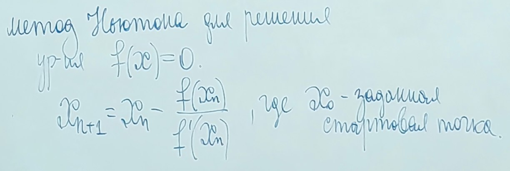

# Лекция 3 05.04.2025
Повторение 

## Быстрое преобразование Фурье

### Алгоритм быстрого преобразования Фурье (FFT)

### Алгоритм Свёртки ( сложность O(n*ln(n)) )

### Деление
 \
Тип реализации:

Метод Ньютона для решения ур-ия f(x) = 0:

Уравнение взято из уравнения касательной \

### Определения

