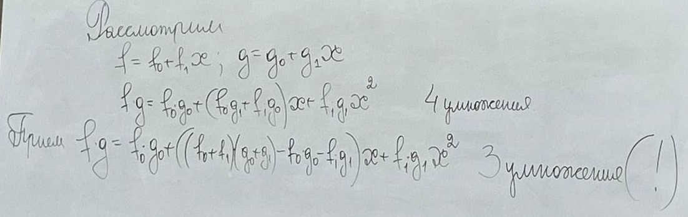
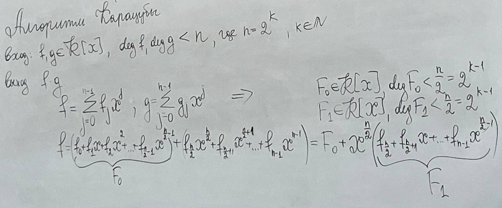
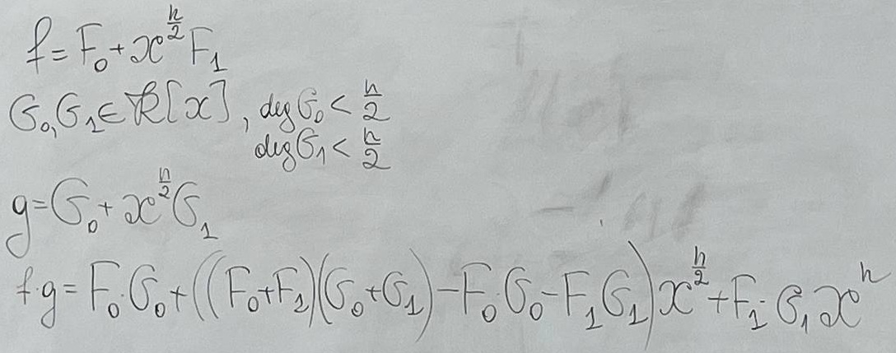

# 22.02.2025 Лекция №1
## Арифметические алгоритмы
Стандартные операции:
- "-"
- "+"
- "*"
- "/"

К каким числам мы будем применять эти операции?\
Целые? Длинная арифметика? Многочлены?\
Числовые множества могут быть разнообразны.

В этом семестре будем вычислять асимптотику (О - большое)!

Примеры кольца:
- Кольцо вычетов

Примеры групп, колец, полей:
- Кольцо вычетов по mod n. - если n - простое то это поле
- R[x], где R - кольцо (Кольцо многочленов от переменной x, с коэффициентом R)
- R[[x]] - кольцо формальных степенные ряды - бесконечная линейная комбинация (ряд может быть обратимым или не обратимым)

 \
Сложность умножения - O(n^2) \
\
(Приём А.А.Карацубы)
### Алгоритм Карацубы

 \
**_(Надо найти более формальное определение!)_**\
Факт - Сложность умножения Карацубы O(n ^ [log2(3)] )\

