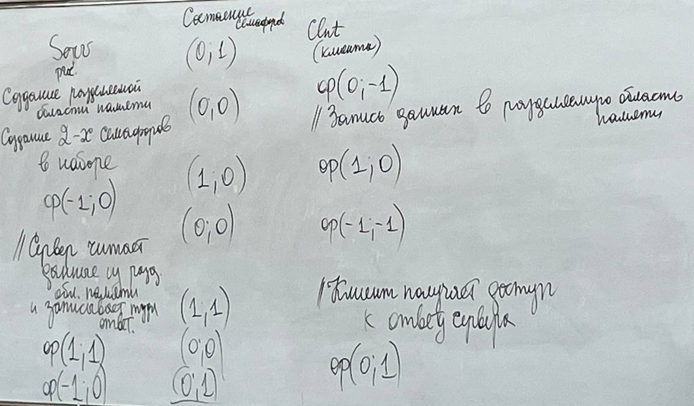

# 22.02.2025 Лекция №1
##

Файл - набор байтов (имя не важно!)

System V - Семафоры набор(массив) целочисленных счётчиков\
**_Работа с этими наборами "атомарная"!_**

Методы для работы с семафорами:
- semget - получить значение семафора
- semop - открывает набор семафоров
- semctl - управление семафорами

Методы для работы с разделяемой памятью:
- shmget - доступ к памяти
- shmat - управление памятью
- shmalt - подключение памяти
- shmctl - отключение памяти

### Синхронизация процессов с помощью семафоров и разделяемой памяти
 
- Набор из 2-х семафоров:
  (0, 0) (1, 0)
  (0, 1) (1, 1)
- Открытие набора семафора:
  op(0;-1)
  op(-1;0)
  op(0;0)
  op(1;1)\

**_Найти это в учебниках!_**
