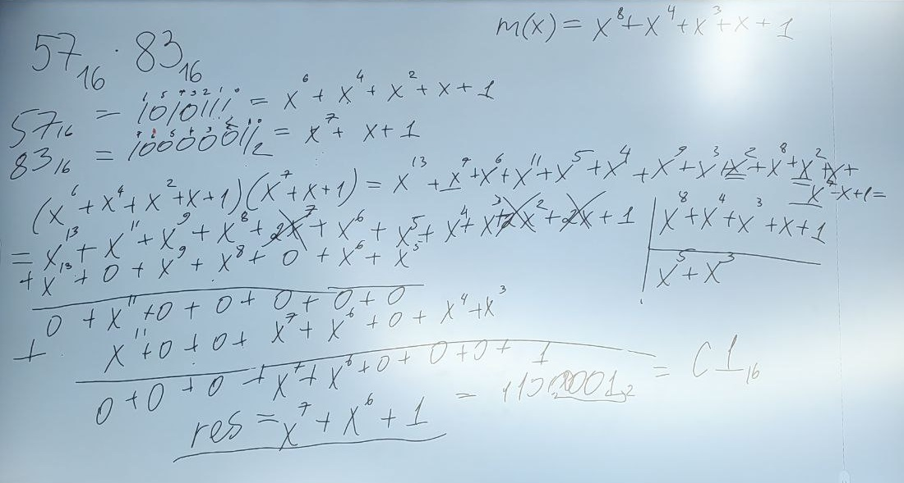

# Лекция №2 15.10.2025
## RSA
$\varphi(n)$ - сумма всех взаимно простых чисел с n \
$\varphi(p) = p - 1$, где p - простое число \
$\varphi(pq) = (p - 1)(q-1)$, где p и q - простые числа
1) $q$, $p$ - простые числа, $N = p \cdot q$, $N$ - публично
2) $e$ - шифрующая экспонента $gcd(e, \varphi(N)) = 1$, (e, N) - открытый ключ
3) Шифрование: m - сообщение (открытый текст), $C \equiv m^e\pmod{n}$ (!!! Как искать?)
4) $d$ - дешифрующая экспонента, $(e \cdot d) \equiv 1\pmod{\varphi(N)}$ 
5) Дешифрование: $m=C^d\pmod{n}$

(Возведение в степень реализуем с помощью быстрого возведения в степень)\
!!! - Используем расширенный алгоритм евклида: $Evk(x, y) = (a, b, d)$, &nbsp;&nbsp;где $d = gcd(x, y) = ax + by$ \
$Evk(e, \varphi(N)) = (a, b, 1)$ ->\
$a \cdot e + b \cdot \varphi(N) = 1$ -> \
$a \cdot e \equiv 1 \pmod{\varphi(N)}$ ->\
$a = e^{-1} = d$
### Обоснование RSA
$C^d \equiv (m^e)^d \equiv m^{ed} \equiv m^{K*\varphi(N) + 1} \equiv$

$\equiv m^{K*\varphi(N)}*m\equiv \text{по теореме Эйлера}  \equiv m \pmod{N}$ 

$\exists k: ed = k*\varphi(N) + 1$

## Rijndal (рейндел) (необходимая теория)

$GF(p^n)$ - конечное поле из $p^n$ элементов, где p-простое, $n \in N$\
_**Пример:**_ $GF(2) = \{0, 1\}$ - (Поле Галуа или конечное поле) \
\+ : xor\
\* : &\
Пример:
$GF(2^8)$\
b (принадлежит полю) $=b_7b_6b_5b_4b_3b_2b_1b_0$ - байт\
$b_j \in \{0, 1\}$, $j \in \{0, ..., 7\}$\
b => $b(x) = \displaystyle\sum_{j=0}^{7}(b_jx^j)$\
$b = 37_{16} = 00110111 = x^5 \oplus x^4 \oplus x^2 \oplus x \oplus 1$\
\+: $a + b := a \oplus b$ 

---
Неприводимый многочлен - многочлен, который нельзя разложить на множители в данном поле\
$m(x) = 11B_{16} = 100011011_2$ - модуль алгоритма Рейнделя: $=x^8+x^4+x^3+x+1$ - неприводимый\
$\forall a, b \in GF(2^8)$\
$a*b \equiv a(x)\cdot b(x) \bmod{m(x)}$ -> $\cdot$ - обычное умножение

---

Упражнение:\
Получить произведение данных элементов в данном поле (+ это xor)\
$57_{16}*83_{16} =$\

---

$b \in GF(2^8)$\
$b \neq 0$\
$b^{-1}$ -- ? Можно использовать расширенный алгоритм Евклида
$b^{2^8 -2} = b^{-1}$ \
$b^{2^8 - 1}=b^{2^8 - 2 + 1} = 1$\
$b^{2^8 -2}b = 1$ => $b^{2^8-2} = b^{-1}$

---
$X^n \pmod{X^4+1} = X^{n \bmod  4}$, $n \in N$\
Доказательство: $X^4 \bmod (X^4 + 1) = 1$\
$x^4=(x^4 + 1) + 1 \bmod (x^4 + 1) = 1$\
$x^{4q} \bmod (x^4 + 1) = 1$
$n = 4q + r$, где $r = n  \bmod 4$\
$x^n = x ^{4q + r} = x^{4q}x^r \bmod (x^4 +1) = x^r = x ^ {n (\bmod 4)}$
