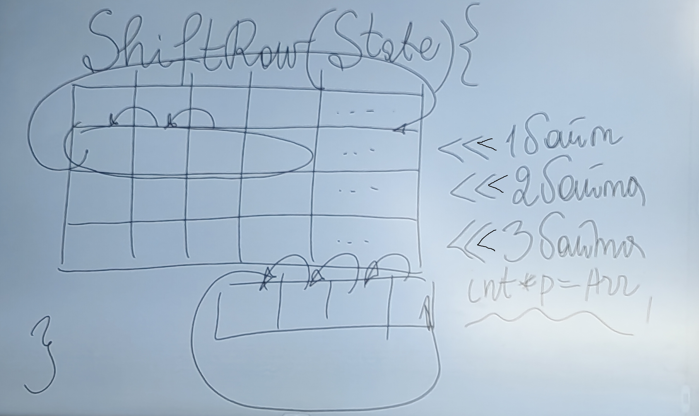
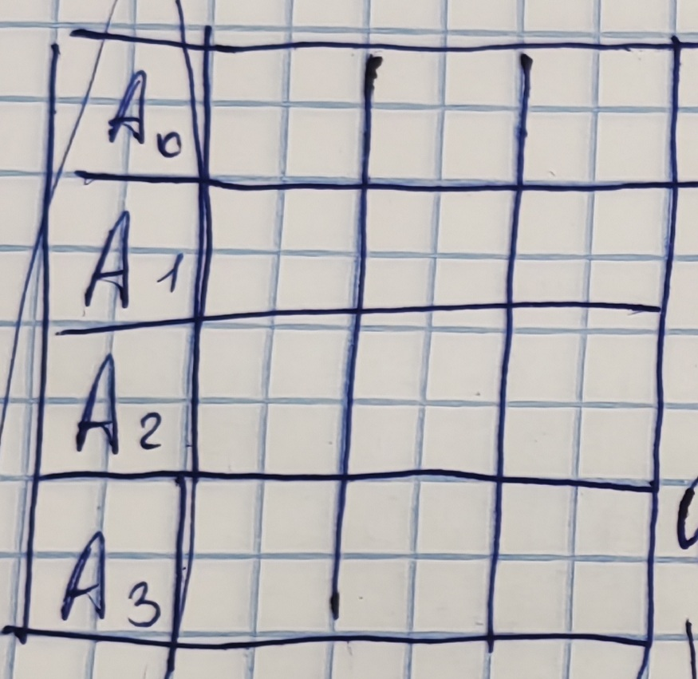
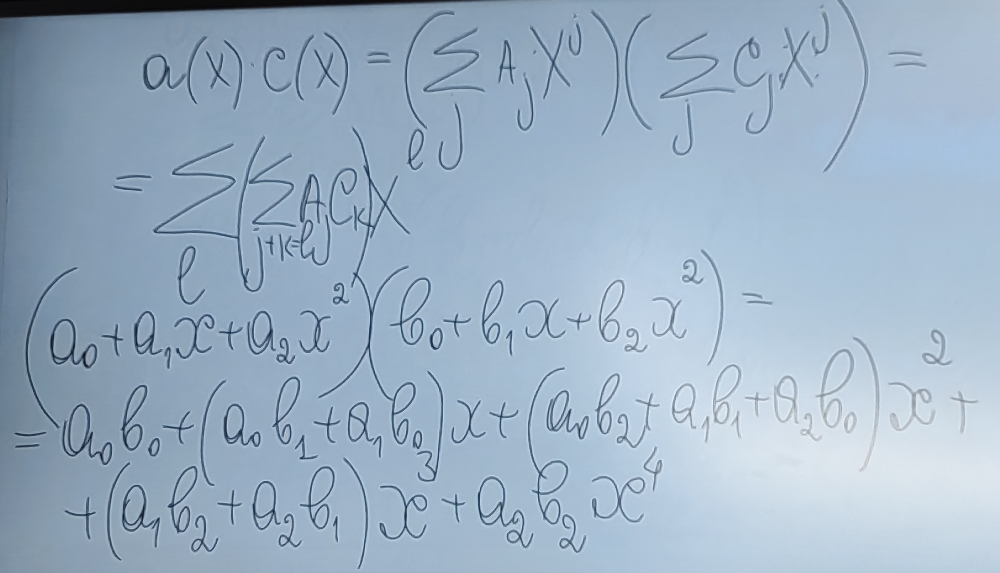

# Лекция № 3. 29.10.2025
## Rijndal (рейндел) (AES)
Сейчас используется
#### Терминология:
Text - 128/192/256\
Key - 128/192/256\
$N_r$ (количество раундов) 10/12/14\
State - текущее состояние открытого текста (интерпретируется как двумерный массив, в котором 4 строки и 4/6/8 (в зависимости от размера открытого текста))
```c++
Round(State, Key_r){
    SubBute(State);
    ShiftRow(State);
    MixColumn(State); // нет в последнем раунде
    AddRoundKey(State, Key_r);
}

AddRoundKey(State, Key_r){
    State[i] = State[i] ^ Key_r[i]
}
```
```c++
ShiftRow(State){
    // См.картинку
    // Сдвиг лучше делать с помощью указателей,
    // чтобы избежать множественное перезаписывание
    
    // Выполняется воздействие на строчки
}
```


```c++
SubBute(State){
    for ... {
        b = State[i]; // Подумали как о многочлене
        b = A * B^{-1} + f; // Обратный из поля Галуа
        State[i] = b
    }
    // Происходит байтовая подмена
    // Нужно генерировать S-блок 
    ------
    char Sbox[256]
    Sbox[i] = A * i ^{-1} + f;
    State[i] = Sbox[State[i]]
    
}
```
$i^{-1}$ - обратный элемент в - $GF(2^8)$


Матрица A

$$
A =
\begin{pmatrix}
1 & 0 & 0 & 0 & 1 & 1 & 1 & 1\\
1 & 1 & 0 & 0 & 0 & 1 & 1 & 1 \\
1 & 1 & 1 & 0 & 0 & 0 & 1 & 1 \\
1 & 1 & 1 & 1 & 0 & 0 & 0 & 1 \\
1 & 1 & 1 & 1 & 1 & 0 & 0 & 0 \\
0 & 1 & 1 & 1 & 1 & 1 & 0 & 0 \\
0 & 0 & 1 & 1 & 1 & 1 & 1 & 0 \\
0 & 0 & 0 & 1 & 1 & 1 & 1 & 1
\end{pmatrix}
$$

$A \times v \oplus f$

---
Трюк:\
Пришло $11011001$:\
$1101 \oplus 1001 = 0100 \to 01 \oplus 00 = 01 \to 0 \oplus 1 = 1$\
Всего 3 $\oplus$

---
$Sbox[i] = A \times i^{-1} + f$\
$invSbox[State[i]] = i$ \
Шифрование: $State[i] = Sbox[State[i]]$\
Дешифрование: $State[i] = invSbox[State[i]]$
```c++
MixColumn(State){
    // Смотри картинку
}
```



$a(x) = A_3 \cdot x^3 + A_2 \cdot x^2 + A_1 \cdot x + A_0$\
$c(x) = 03_{16} \cdot x^3 + 01_{16} \cdot x^2 + 01_{16} \cdot x + 02_{16}$\
$a(x) = a(x) \cdot c(x) \mod {(X^4 + 1)}$


Для дешифрования нужно взять многочлен $d(x) = 0B_{16} \cdot x^3 + 0D_{16} \cdot x^2 + 09_{16} \cdot x + 0E_{16}$
