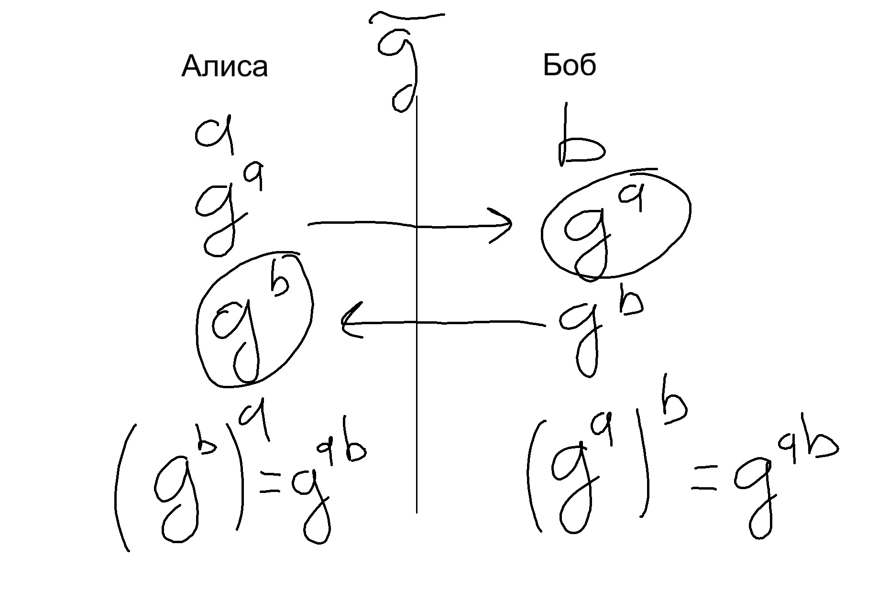

# Лекция № 4 12.11.2025
## Проблема Обмена ключами
### Протокол Диффи-Хеллмана
$x \in \mathbb{N}: a^x = b$\
$a, b \in G$\
$x = log_a(b)$ - Долго считать\
$G = < g >$, $\forall g \in G : a = g^m$\
\
a - знает только Алиса, b - знает только Боб\
$\tilde{g}$ известно всем
### Схема Шамира
Цель, восстановить ключ у n > 2 человек ключ\
K - ключ делим на W частей так, чтобы по T из них можно восстановить K. 
Это называется _(T, W)-пороговая схема_.
#### Алгоритм:
Выбираем число P - простое, так чтобы $P > W + 1$. $K \in F_p$, где
$F_p$ - поле вычетов по модулю P. \
Доверенное лицо (д.л.) выбирает: $x_i \in F_p$, $i = 1, 2,..., W$\
Каждый участник получает свой личный $x_i$, этот параметр известен.\
Из $F_p$ д.л. выбирает $T-1$ элемент и строит многочлен $F(x) = K + \displaystyle\sum_{j = 1}^{T-1}a_jx^j$.\
$y_i = F(x_i)$, y_i выдаётся соотв. участнику (это секрет)\
L - участников собрались и строят систему уравнений:

$$
\begin{cases}
y_1 = K + \displaystyle\sum_{j = 1}^{T-1}a_jx_1^j\\
y_L = K + \displaystyle\sum_{j = 1}^{T-1}a_jx_L^j
\end{cases}
$$

#### Алгоритм восстановления ключа:
$B_j = \displaystyle\prod_{\alpha = 1}^{T}\frac{x_\alpha}{x_\alpha - x_j}$\
$K = \displaystyle\sum_{j = 1}^TB_jy_j$

