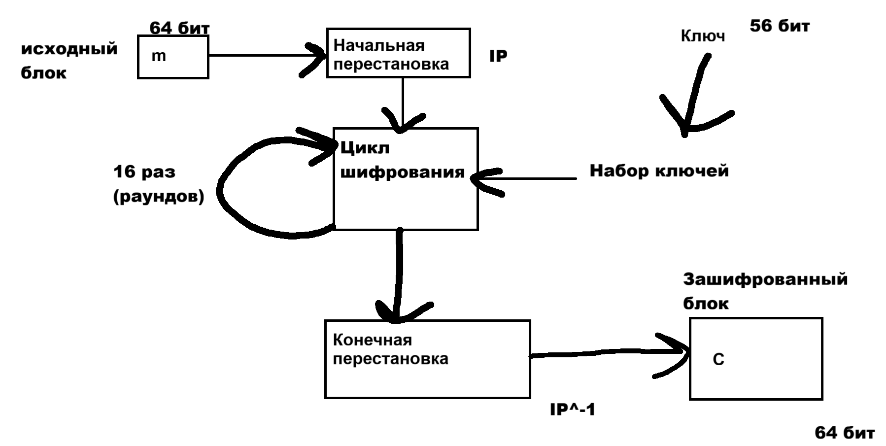
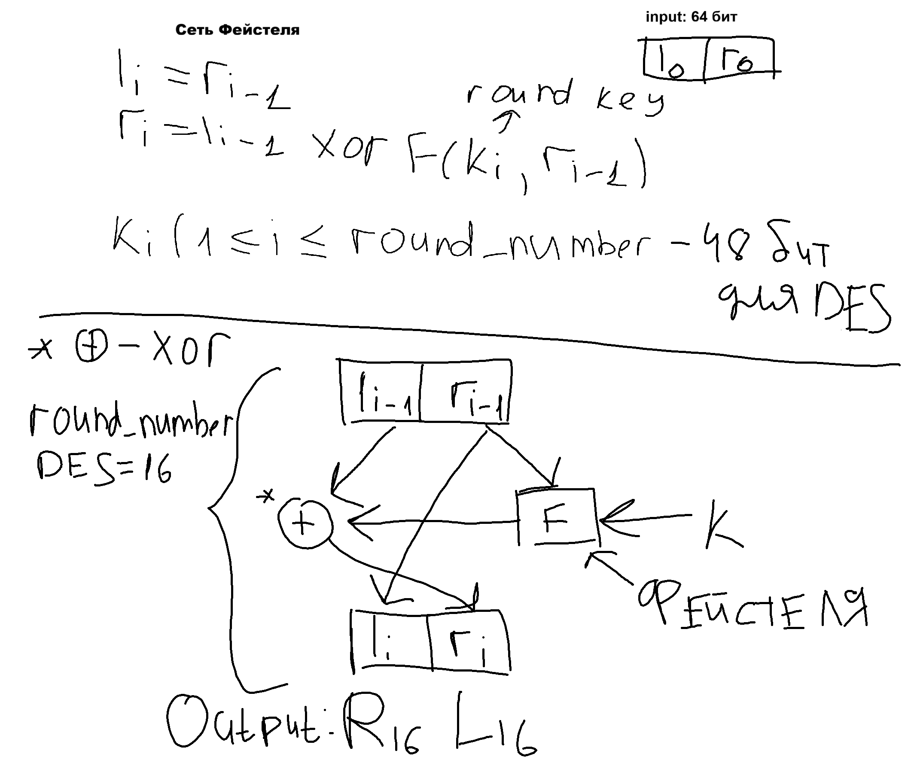

# Пз №1 27.09.2025
**_Книга: Смарт Криптография_**
## Введение

#### Основные формулы криптографии:
1) _**C = E_k(m)**_ - Шифрование
2) _**m = D_k(C)**_ - Дешифрование
3) k - Key ключ шифрования, секретный ключ

#### Алгоритмы шифрования бывает:
1) Симметричное - из одного ключа можно получить другой (Пример: DES)
2) Асимметричные - нельзя найти один ключ по другому (Пример: RSA)

#### Также:
1) Потоковые (Устаревшее) - берёшь каждый символ и шифруешь
2) Блочные (То чем мы будем заниматься)

_Существует система падинга (добивания последнего блока элемента)_

### Битовые операции
- Пример1: (x & 1) == 0 - проверка на чётность 
- Исключающее или: xor, ^ (Сложение по модулю 2)
- Пример2: 10011 ^ 11010 = 01001
- Пример3: (x^y)^y = x
- swap(a, b): a = a ^ b; b = a ^ b; a = a ^ b;
- Умножение на степень (n) 2: x << n
- Деление на степень (n) 2: x >> n 
- Проверка n-ого бита: (x & (1 << n)) != 0
- Установка n-ого бита: (x | (1 << n))
- Циклический сдвиг: 
```C++
rotate_left(uint64 x, int n){
    n %= 64;
    return (x << n) | (x >> (64 - n));
}
```
### Алгоритм шифрования DES:
Фан факт 3DES: делаем дес 3 раза
Свойства: 
- Симметричный
- Размер ключа: 56 бит + 8 проверочных (8 проверочных не используется в шифровании)
- Размер блока: 64 бит
Алгоритм:
  \
Сеть Фейстеля (Функция Фейстеля)\
- 

