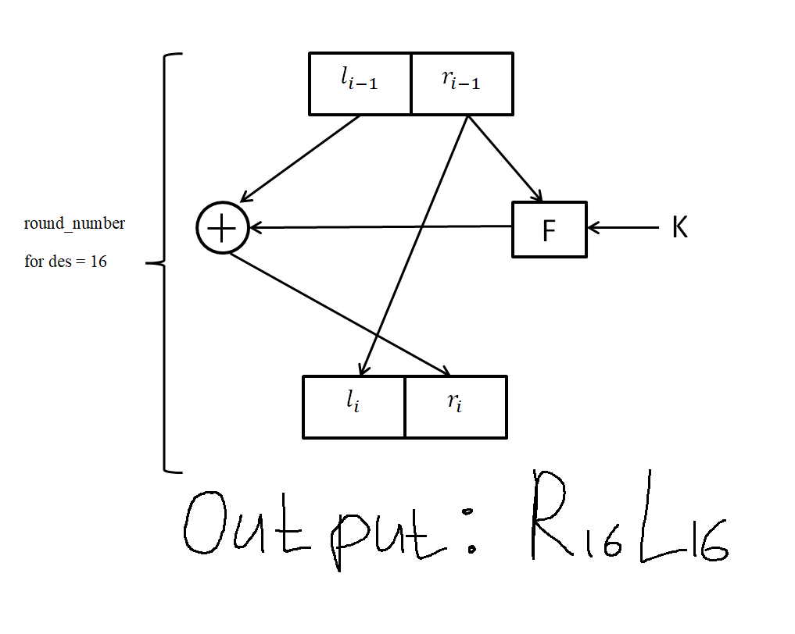

# Пз №1 27.09.2025
**_Книга: Смарт Криптография_**
## Введение

### Основные формулы криптографии:
1) $C = E_k(m)$ - Шифрование
2) $m = D_k(C)$ - Дешифрование
3) $k$ - Key ключ шифрования, секретный ключ

### Алгоритмы шифрования бывает:
1) Симметричное - из одного ключа можно получить другой (Пример: DES)
2) Асимметричные - нельзя найти один ключ по другому (Пример: RSA)

#### Также:
1) Потоковые (Устаревшее) - берёшь каждый символ и шифруешь
2) Блочные (То чем мы будем заниматься)

_Существует система падинга (добивания последнего блока элемента)_

### Битовые операции
- Пример1: ```(x & 1) == 0``` - проверка на чётность 
- Исключающее или: ```xor```, ```^``` (Сложение по модулю 2) \
Пример2: ```10011 ^ 11010 = 01001``` \
Пример3: ```(x ^ y) ^ y = x```
- swap(a, b):
  ```C++
  a = a ^ b;
  b = a ^ b;
  a = a ^ b;
  ```
- Умножение на степень (n) 2: ```x << n```
- Деление на степень (n) 2: ```x >> n```
- Проверка n-ого бита: ```(x & (1 << n)) != 0```
- Установка n-ого бита: ```(x | (1 << n))```
- Циклический сдвиг влево: 
  ```C++
  rotate_left(uint64 x, int n){
      n %= 64;
      return (x << n) | (x >> (64 - n));
  }
  ```
### Алгоритм шифрования DES:
Фан факт: 3DES делаем дес 3 раза
#### Свойства:
- Симметричный
- Размер ключа: 56 бит + 8 проверочных (8 проверочных не используется в шифровании)
- Размер блока: 64 бит

#### Алгоритм:

  \
Сеть Фейстеля (Функция Фейстеля) \
Блок попавший в сеть Фейстеля делится попалам на $l_0$ и $r_0$ в сумме дающие 64 бит\
Последующие $l_i$ и $r_i$ высчитываются по формулам: \
$l_i = r_{i-1}$ \
$r_i = l_{i-1} \oplus F(k_i, r_{i -1})$\
$k_i$ $(1 \leq i \leq roundNumber)$ - round key. 48 бит для DES 

 
#### IP и IP^(-1):


### Функция Фейстеля.
input: 32 бит - Blok, $k_i$ - 48 бит
### $F(r_(i-1), k_i)$:
1) функция расширения E: расширения 32 бита в 48 битов
Входят биты, выходят переставленные биты \
По таблице переставляются входящие биты и получаются новые выходящие биты\

2) То что получилось в 1 пункте $\oplus K_i$
3) Преобразования S (8 S-блоков) \
$B_1, B_2, ..., B_8$, где $B_i$ - 6 бит Для каждого $B_i$ своя $S$ таблица (берутся из стандарта)\
Пример: \
$B_6 = 100110$ -> $S_6$ \
$x = 10$ (1 и 6 бит) $= 2$ - номер строки в таблице $S_6$ \
$y = 0011$ (2 - 5 биты) $= 3$ - номер столбца в таблице $S_6$ \
 \
В случае если $S_6$ в линейном массиве находим элемент как $x * 16 + y$ \
Результат из таблички это новые 4 бита (если представить в двоичной системе) $B'_6 = 5 = 0101$ \
Получаем $B'_1, B'_2, ..., B'_8$
4) Перестановка $P$ \
 \
Просто перестановка по этой таблице, на 1 месте 16-ый бит, на 2 месте 7-ый бит

#### Key schelude
1) $key = ...$ 56 бит 8 * 7\
На 7, 15, 23 ... ставятся ещё биты так, чтобы единицы в каждой восьёрке было нечётно \
Пример: 1001011_, на место пропуска ставится 1, и всего единиц становится 5 \
Так ключ становится 64 битным
2) key 64 бит Заполняем $C_0$ $D_0$ по табличке: \

Количество битов у них по 28
3) $C_i = C_(i-1) <<< n_i$\
$D_i = D_(i-1) <<< n_i$ \
$n_i$ смотрится по табличке\

4) $K_i$ из $C_i$ $D_i$ Смотрим каждый бит по таблице \


## Дешифрование
$R_(i-1) = L_i$ \
$L_(i-1) = R_i$ xor $F(L_i, K_i)$ для i от 16 до 1