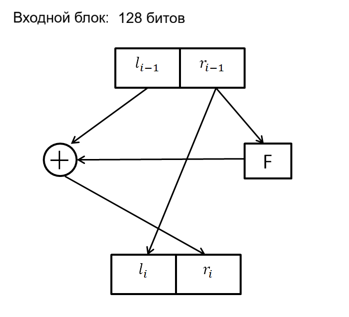
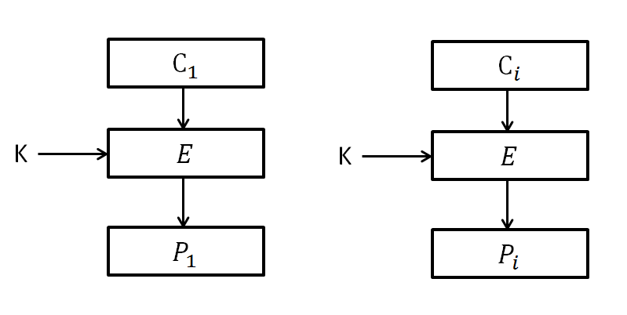

# Пз № 2 11.10.2025
## DEAL - алгоритм шифрования
DEAL расширенная версия DES:
1) DEAL-128 -> 6 раундов
2) DEAL-192 -> 6 раундов
3) DEAL-256 -> 8 раундов

Проблемы:
1) Есть слабые ключи
2) Медленный

### Сеть Фейстеля для DEAL

$F = DES(R_{i-1}, RK_i)$\
$\overline{k} = 0X1234567890ABCDEF_{16}$
### DEAL-128 Генерация ключей:
$E = DES, KEY(128 бит) = K_1 | K_2$\
$RK_1 = E_{\overline{k}}(K_1)$\
$RK_2 = E_{\overline{k}}(K_2 \oplus RK_1)$\
$RK_3 = E_{\overline{k}}(K_1 \ \oplus <1> \oplus \ RK_2)$ \
(\<i\> - 64-х битное целое число, в котором i-1 бит равен 1 (включительно), все остальные равны 0 (Операция "сидели мужики и пили пиво")\
$RK_4 = E_{\overline{k}}(K_2 \oplus <2> \oplus RK_3)$ \
$RK_5 = E_{\overline{k}}(K_1 \oplus <4> \oplus RK_4)$ \
$RK_6 = E_{\overline{k}}(K_2 \oplus <8> \oplus RK_5)$ 
### DEAL-192 Генерация ключей:
$E = DES, KEY(192 бит) = K_1 | K_2 | K_3$\
$RK_1 = E_{\overline{k}}(K_1)$\
$RK_2 = E_{\overline{k}}(K_2 \oplus RK_1)$\
$RK_3 = E_{\overline{k}}(K_3 \oplus RK_2)$ \
$RK_4 = E_{\overline{k}}(K_1 \oplus <1> \oplus RK_3)$ \
$RK_5 = E_{\overline{k}}(K_2 \oplus <2> \oplus RK_4)$ \
$RK_6 = E_{\overline{k}}(K_3 \oplus <4> \oplus RK_5)$ 
### DEAL-256 Генерация ключей:
$E = DES$, $KEY(192 \ бит) = K_1 | K_2 | K_3 | K_4$ 8 раундов\
$RK_1 = E_{\overline{k}}(K_1)$\
$RK_2 = E_{\overline{k}}(K_2 \oplus RK_1)$\
$RK_3 = E_{\overline{k}}(K_3 \oplus RK_2)$ \
$RK_4 = E_{\overline{k}}(K_4 \oplus RK_3)$ \
$RK_5 = E_{\overline{k}}(K_1 \oplus <1> \oplus RK_4)$ \
$RK_6 = E_{\overline{k}}(K_2 \oplus <2> \oplus RK_5)$ \
$RK_7 = E_{\overline{k}}(K_3 \oplus <4> \oplus RK_6)$ \
$RK_7 = E_{\overline{k}}(K_4 \oplus <8> \oplus RK_7)$
#### Дешифрование:
$E_k = DES(R_{i-1}, RK_i)$ - шифрование \
Дешифрование: ключи подаются в обратном порядке

### Режимы шифрования:
[Режимы шифрования википедия на русском](https://ru.wikipedia.org/wiki/Режим_шифрования)
[Режимы шифрования википедия на английском](https://en.wikipedia.org/wiki/Block_cipher_mode_of_operation)
1) ECB: Шифрование - $C_i = E(P_i, K)$, Дешифрование - $P_i = D(C_i, K)$

    Плюсы:
   - Мы не зависимы, можем шифровать/дешифровать параллельно разные блоки

    Минус:
   - Одинаковые блоки шифруются/дешифруются одинаково
2) CBC
3) PCBC
4) CFB
5) OFB
6) CTR
7) RD - $C_i = E_k(P_i \oplus IV_i)$
### Режим набивки
1) Zeros:\
    Пример: \
    input_must: 8 byte\
    input: 41 42 43 = 3byte
    Добили: 41 42 43 00 00 00 00 00 и это ок\
    Но если бы пришили 41 42 00, то проблема возникает, где остановится при дешифровке
2) ANSI X9.23 \
    Пример: 41 42 43 00 00 00 00 05\
    То есть добивать байты, а в последнем байте написать сколько битов было добито
3) PKCS7 \
    Пример: 41 42 43 05 05 05 05 05
4) ISO10126 \
    Пример: 41 42 43 81 A6 FF 33 05 (Последний байт указывает сколько добили, последний просто мусор)
 
