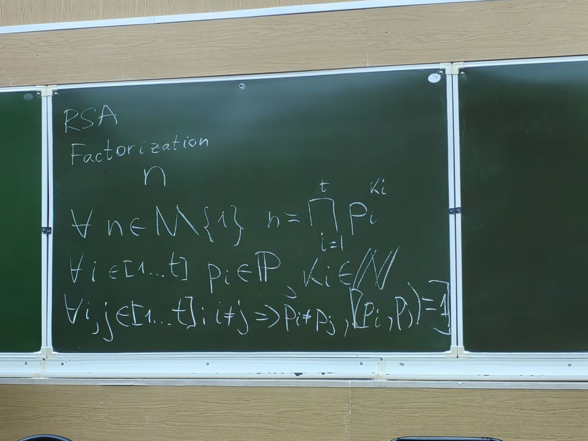
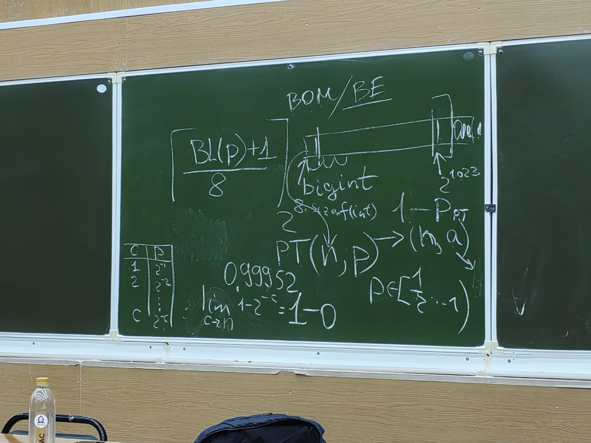
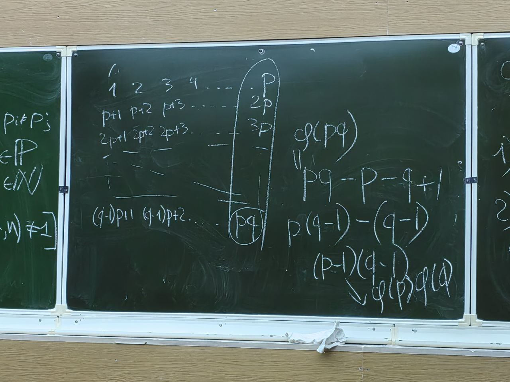
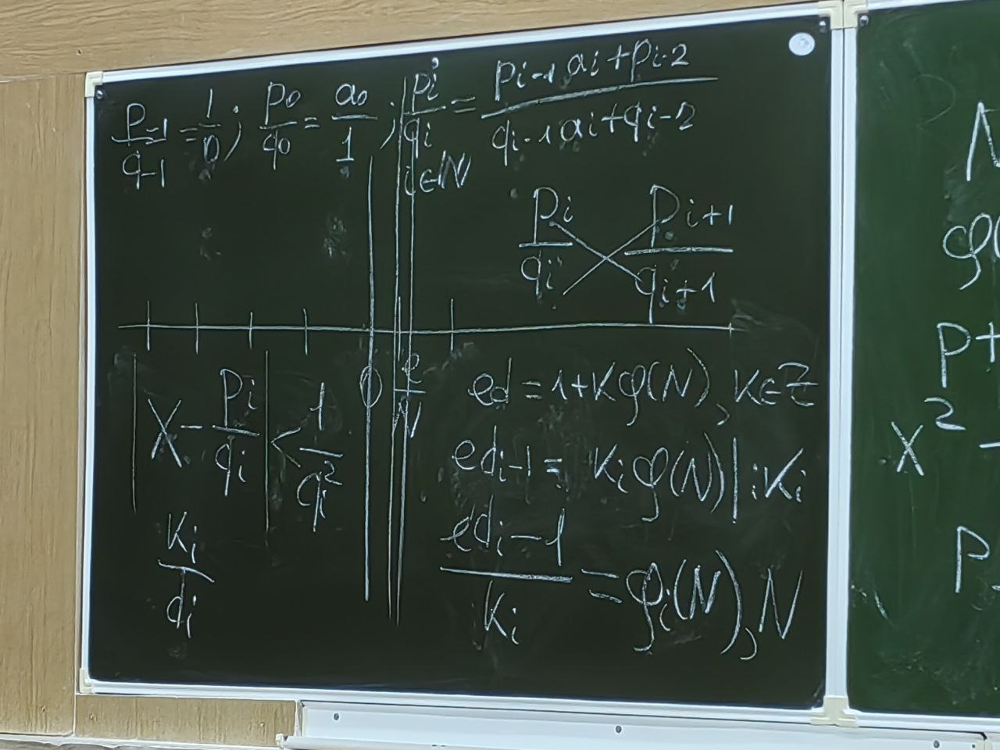
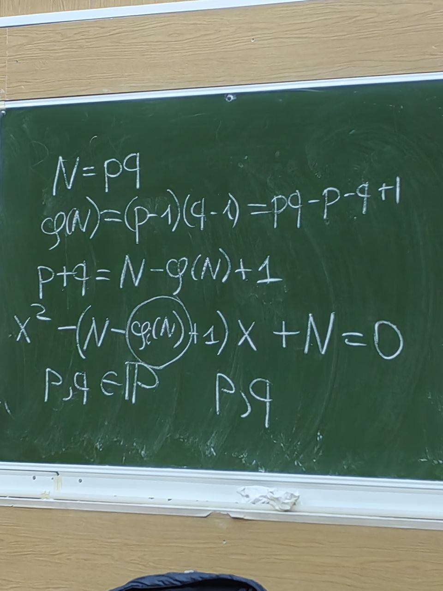
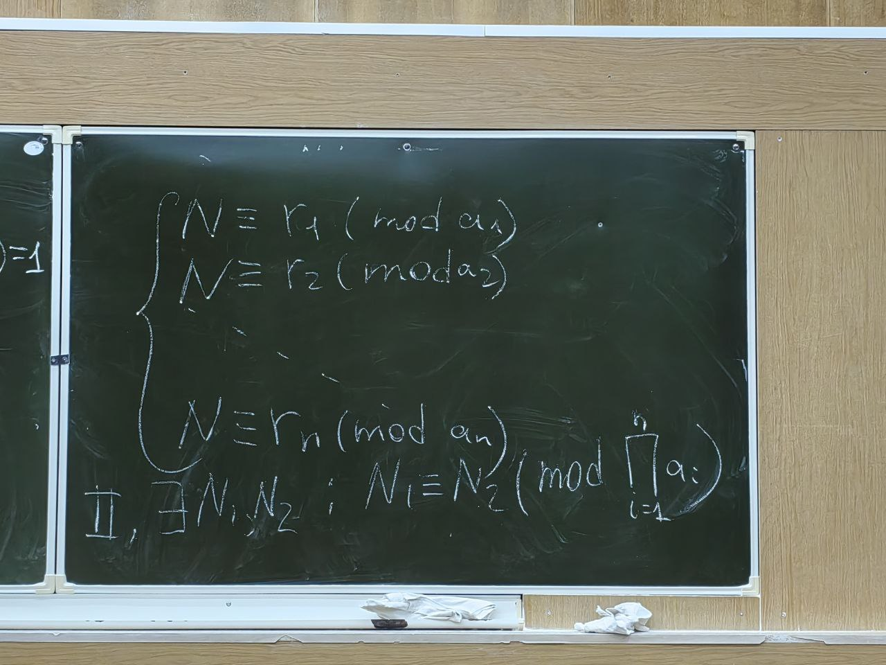

## Пз № 4 дополнительное занятие. 29.11.2025

### Повторение пз № 3
### RSA 
Факторизация - любое натуральное число (кроме единицы) можно представить в виде произведения простых чисел в степени: \
\
Числа близнецы: p, q, такие что $|p - q| = 2$\
Для RSA числа не должны быть приблизительно близкими (близнецами)!!! \
BL(p) = BL(q), где BL - битовая длина\
Обычно хранятся ячейками $2^{8 \cdot sizeof(int)}$\
Тест простоты PT

\
$1-P_{PT}^{-C} > p_u$ - Неравенство для оценки количества итераций для достижения требуемой вероятности простоты числа.\
Малая теорема Ферма:\
$a, p: p \in P, a \in Z : (a, p) = 1$\
$a^{p-1} \equiv 1 \pmod{p}$\
Доказательство:\
$a^{p} - a \equiv 0 \pmod{p}$\
По индукции: \
$a = 1:+$\
Пусть $a = k:+$\
Рассмотрим $a = k + 1:+$\
Подставим: $(k + 1)^p - (k + 1) \equiv 0 \pmod p$\
$\sum_{i = 0}^p C_p^ik^i - k - 1 \equiv 0 \pmod p$\
$\sum_{i = 1}^{p - 1} C_p^ik^i - k - 1 + 1 + k^p \equiv 0 \pmod p$\
$\sum_{i = 1}^{p - 1} C_p^ik^i - k + k^p \equiv 0 \pmod p$\
$\sum_{i = 1}^{p - 1} C_p^ik^i + k^p - k \equiv 0 \pmod p$\ (Из предположения =>)\
$\sum_{i = 1}^{p - 1} \frac{p!k^i}{i!(p-i)!} \equiv 0 \pmod p$\
$\sum_{i = 1}^{p - 1} \frac{p(p-1)!k^i}{i!(p-i)!} \equiv 0 \pmod p$\
(Евклидовы Кольца почитать!!)\
Символ Лежандра - $(\frac{a}{p})$, где $a \in Z$, $p \in P / \{2\}$\
$(\frac{a}{p})$ равно 1, если $\exists x: x^2 \equiv a \pmod p$, 0 если p|a, -1 если $\nexists x: x^2 \equiv a \pmod p$\
$(\frac{a}{n})$, где $a \in Z$, $n \in N / \{1\}$ 2 не делит n\
$n = \prod_{i=1}^t p_i^{k_i}, \forall i, j \in [1, ..., t] i \ne p_i \ne p_j$, $p_i \in P$, $k_i \in N$\
$(\frac{a}{n}) = \prod_{i=1}^t(\frac{a}{p_i})^{k_i}$  $[=0 <=> (a,n) \ne 1]$\
Для всех тестов (n, a) $a \in [2,...,n)$
 - Тест Ферма
   - $a^{n - 1} \equiv 1 \pmod n$
   - $P_{PT} = \frac{1}{2}$
   - Риск нарваться на число Кармайкла
 - Тест Соловея-Штрассена
   - (a, n) = 1
   - $a^{\frac{p-1}{2}} \equiv (\frac{a}{n}) \pmod n$
   - $P_{PT} = \frac{1}{2}$
   - Если равно не -1, то число составное
 - Тест Миклера-Рабина
   - $n- 1 = 2^d \cdot S$, S не делится на 2
     1) $a^s \equiv 1 \pmod n$
     2) $\forall i \in [1,..., d] $ $ a^{2^iS} \equiv -1 \pmod n$
   - $P_{PT} = 4^{-1}$

pq = N\
$\varphi(N) = \sum^{N-1}_{i=1 ((i, N) = 1)}1$\
Пример: $\varphi(20) = 8$ \
1, 2-, 3, 4-, 5-, 6-, 7, 8-, 9, 10-, 11, 12-, 13, 14-, 15-, 16-, 17, 18-, 19\
1) $\varphi(p) = p - 1$ <=> $p \in P$
2) $\varphi(ab) = \varphi(a)\varphi(b)$, $(a, b) = 1$

\

Определение кольца (Легендарное) $R = \{X_R, +_R, *_R\}$ -
1)  $X_R$ - не пустое множество
2) ${X_R, +_R} = A$
   1) $\forall x_1, x_2 \in X_R$ $x_1 +_R x_2 \in X_R$ (Если выполняется только это свойство то эта структура называется Магма)
   2) $\forall x_1, x_2, x_3 \in X_R$ $(x_1 +_R x_2) +_R x_3 = x_1 +_R (x_2 +_R x_3)$ (При выполнении 1-2 то это полугруппа)
   3) $\exists e_{+_R} \in X_R \forall x \in X_R$, $e_{+_R} +_R x = x$ (1-3 Моноид)
   4) $\forall x \in X_R \exists! x^{-1} \in X_R: x^{-1} +_R x = e_{+_R}$ (1-4) группа
   5) $\forall x_1, x_2 \in X_R$: $x_1 +_R x_2 = x_2 +_R x_1$ (Коммутативная группа\ Абелева группа)
3) ${X_R, *_R} = H$ - полугруппа
4) $\forall a, b, c \in R$ : $a *_R (b +_R c) = a *_R b + a *_R c$

GF(x) - Поле Галуа\
$GF(p^n)$ - Возможно построить поле

$(\varphi(pq = N) = (p-1)(q-1), e) = 1$\
$d \equiv e^{-1} \pmod{\varphi(N)}$\
Обычное e = 65537 - Число Ферма. Битовая картинка 10...01\
$\forall x \in G, x \ne e_{TG}$\
$x^{|G|-2} = x^{-1}$ (Свойство)\
$e^{\varphi(N) - 2} \pmod{\varphi(N)} = d$\

$m_1, m_2, m_3 ... m_?$\
$c_1, c_2, c_3, ..., c_?$\
$? \ge e$ То шифрование можно взломать\
Если $d < \frac{N^{0.25}}{3}$, то е нужно менять\
Атака Винера:\
Цепная дробь: $[a_0 \in N - {0}, a_1, a_2, ..., a_n \in N - {1}]$\
$a_0 + \frac{1}{a_1 + \frac{1}{a_2+...}}$\
$\frac{p_{-1}}{q_{-1}}=\frac{1}{0}$; $\frac{p_0}{q_0}=\frac{a_0}{1}$; $\frac{p_i}{q_i} = \frac{p_{i-1} \cdot a_i + p_{i-2}}{q_{i-1} \cdot a_i + p_{i-2}}$\
$|X-\frac{p_i}{q_i}| < \frac{1}{q^2_i}$\
Если $d < \frac{N^{0.25}}{3}$ выполняется, то при разложении $\frac{e}{N}$ в цепную дробь, один из элементов этой дроби будет d\
\
\

### Шифрование:
1) $m \in [0, N)$
2) (m, N) = 1
3) (e, N) $C = m^e \pmod N$
4) (d, N) $m = c^d \pmod N$
$m \equiv (m^e \pmod n)^d \pmod N$
$m \equiv m^{ed} \pmod N$
#### КТО (Китайская теорема об остатках)
$a_1, a_2, ..., a_n \in N - {1}$\
$\forall i, j \in [1, n]: i \ne j => (a_i, a_j) = 1$\
$r_1, r_2, ..., r_n \in Z$\
$\forall i \in [1...n] r_i \in [0, ... a_i)$\
##### I
$\exists ! N \in [0...\prod_{i=1}^na_i):$\
\

