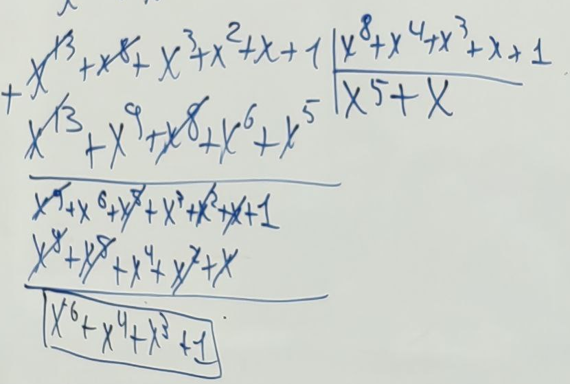
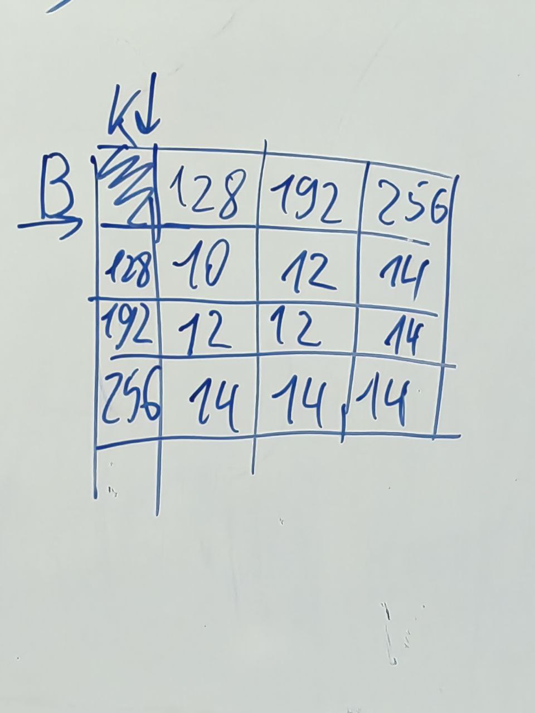
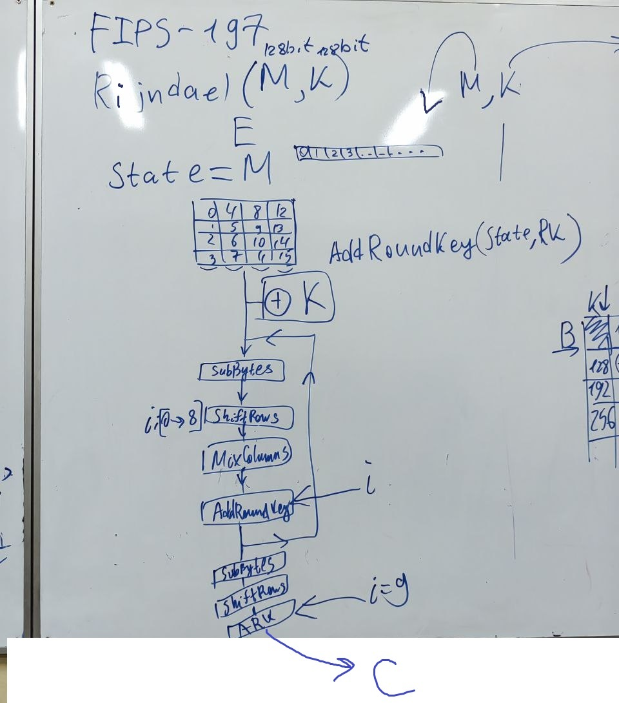
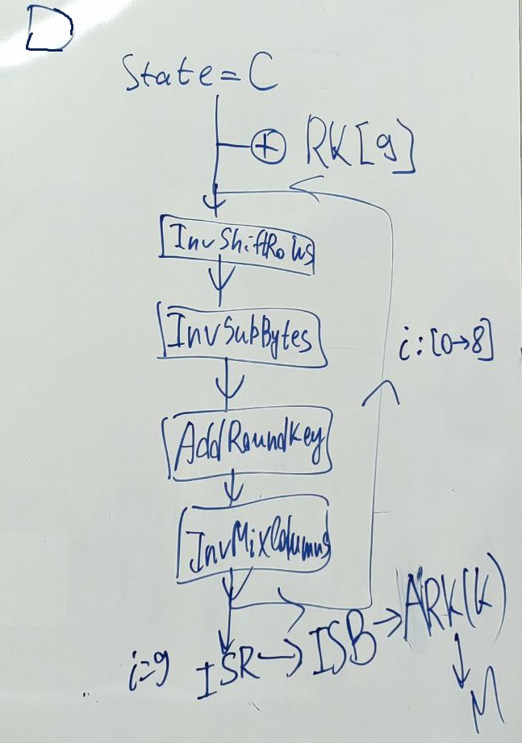
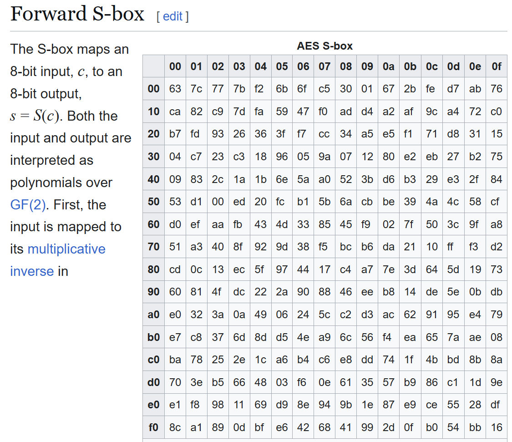
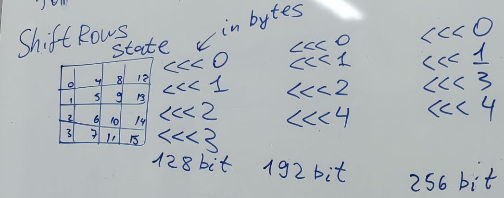
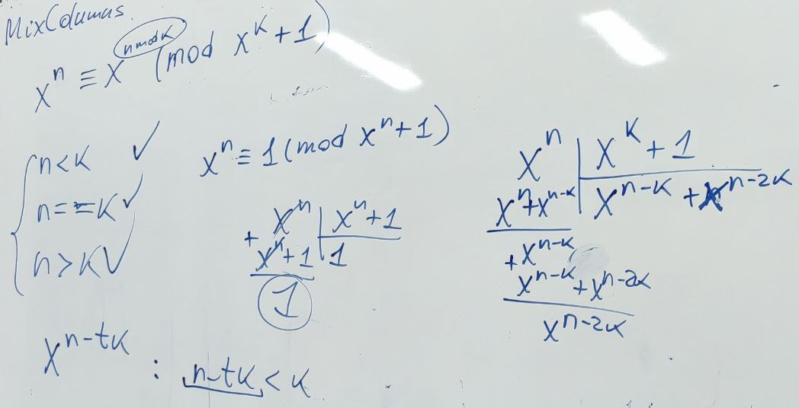
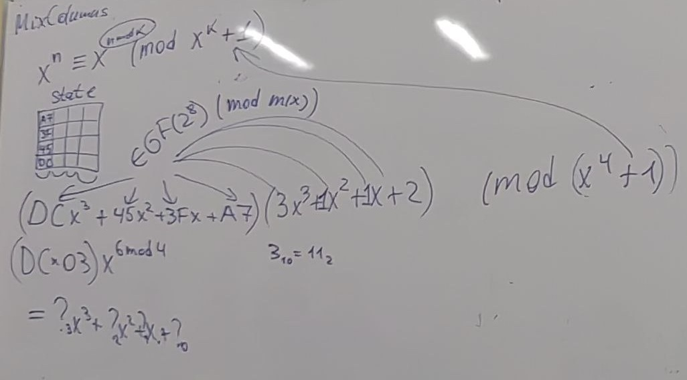
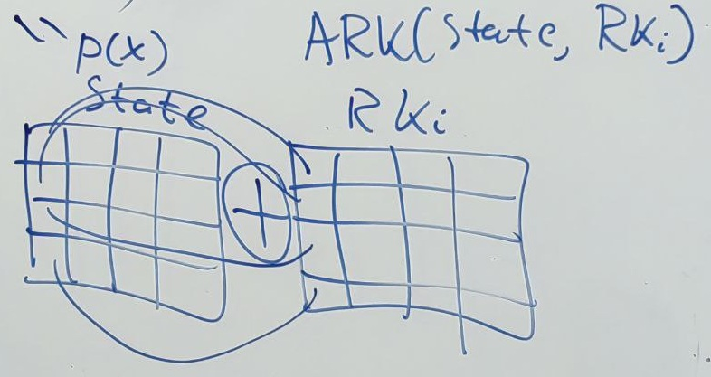
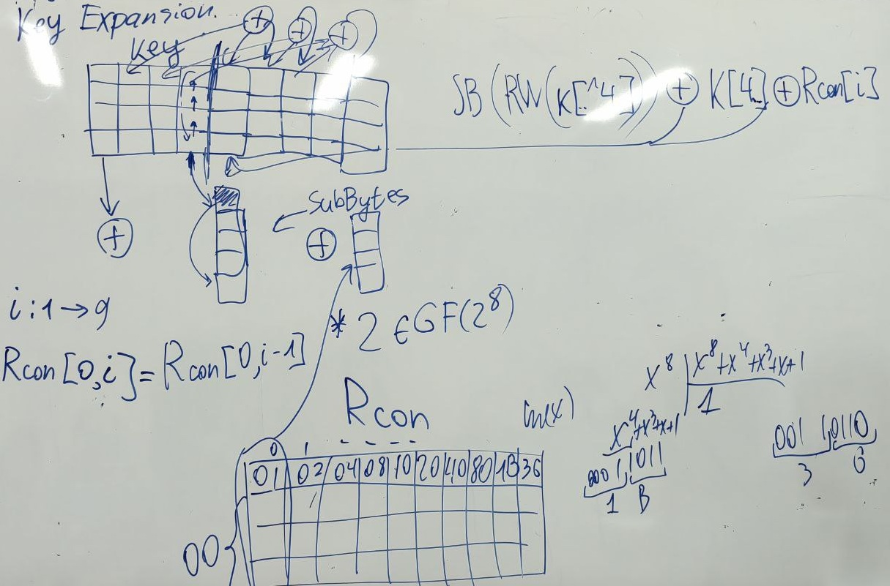

# Пз № 5 дополнительное занятие. 06.12.2025

### Вопрос ответ по RSA
1) Как генерируются p и q?
2) Проверка на простоту с вероятностью 1 
3) Почему алгоритм Евклида является алгоритмом? 
4) Что такое кольцо?
5) Теорема Ферма (формулировка и доказательство)


### Вопрос ответ по сегодняшнему занятию
1) Построить поле из 10 элементов (Вопрос с подвохом - это нельзя сделать)

## Алгоритм Rijndael (по-другому писать нельзя)
(Операции для элементов поля Галуа реализуются через битовые операции)\
_Закон Мора_: количество транзисторов увеличивается в два раза каждые 18 месяцев.\
Создали DESCracker - может перебором взломать DES.\
TripleDES - $E_{K_3}(E_{K_2}(E_{K_1}(m))) = c$. При этом $\nexists K_4: D_{K_4}(c) = m$\
XEX Attack \
AES конкурс для нового стандарта шифрования\
Требования:
1) Устойчивый
2) Block: 128 bit, Key: 128/192/256 bit
3) Должно обладать лавинным эффектом (возникает <=> каждый бит входящего текста и каждый бит ключа влияют на каждый бит выходного текста)
4) Эффективно аппаратная реализация \
В первом этапе прошли: MARS, RC6, Serpent, Twofish, Rijndael\
Во втором те же прошли. Третий этап был голосованием и в нём победил Rijndael.\
Разница AES и Rijndael: AES - стандарт, Rijndael - алгоритм.\

Поле Галуа, замкнутость по умножению. \
$GF(p^n)$ - обозначение поле Галуа, где $p \in P, n \in N$

Свойства поля галуа:
1) $X$ - непустое
2) $\{X, +\} - A$
   1) $\forall x_1, x_2 \in X: x_1 + x_2 \in X$
   2) $\forall x_1, x_2, x_3 \in X: (x_1 + x_2) + x_3 = x_1 + (x_2 + x_3)$
   3) $\exists ! e_+: \forall x \in X: x + e_+ = e_+ + x = x$
   4) $\forall x \in X \\\ \exists ! x^{-1} \in X: x + x^{-1} = e_+$
   5) $\forall x_1, x_2 \in X x_1 + x_2 = x_2 + x_1$
3) $\{X / e_+, *\} - A$
4) $\forall a, b, c \in X : a * (b + c) = a * b + a * c$ \

Определение +, * и обратный элемент в $x \in GF(2^8)$ или $ x = p(x) = \sum^7_{i = 0}a_ix^i$, где $a_i \in GF(2)$: \
1) $x + y$
   - Пример $(x^7 + x^6 + x^3 + x^2 + 1) + (x^6 + x^5 + x^4 + x^3 + x + 1)$ $= (x^7 + x^5 + x^4 + x^2 + x) \in GF(2^8)$
   - Коэффициенты складываем как xor, а не обычный плюс
2) $x * y$
   - $(x^7 + x^6 + x^3 + x^2 + 1) * (x^6 + x^5 + x^4 + x^3 + x + 1) = $ 
   $= x^13 + x^12+ x^9 + x^8 + x^6 + x^12 + x^11+ x^8 + x^7 + x^5 + x^11 + x^10+ x^7 + x^6 + x^4 +$
   $+ x^10 + x^9+ x^6 + x^5 + x^3 + x^8 + x^6+ x^4 + x^3 + x + x^7 + x^6 + x^3 + x^2 + 1 =$
   $= x^13 + x^8 + x^3 + x^2 + x + 1$
   - $x^8 + x^4 + x^3 + x + 1$ - аналог простого числа для поля (запомнить) на него делится результат полученный в предыдущем пункте
   - 
3) $x^{-1}$
   - $\forall x \in G: x^{|G|-2}=x^{-1}$
   - Можно найти из расширенного алгоритма Евклида -> Коэффициенты Безу

### Алгоритм (FIPS-197 можно тут всё глянуть)
Rijndael (M(128 bit), K(128 bit)), M - сообщение, K - ключ \
!!!state - копируется один раз, и больше не создаётся. Меняются байтики внутри!!! \
MixColumns в последнем раунде не выполняется, чтобы была выполнимость \
Определение количество раундов - \
Шифрование:  \
AddRoundKey - involution => обратный ему не вводится\
Дешифрование: 

SubBytes (https://en.wikipedia.org/wiki/Rijndael_S-box): 
 - AES (не для Rijndael. Для Rijndael матрица вычисляется) $x^8 + x^4 + x^3 + x + 1$
```asm
for b: State
    b <- S[b]
```
Вычисление s-block для Rijndael: 
1) $00_{16} \\\ 01_{16} \\\ ... \\\ FE_{16} \\\ FF_{16}$ -> ищем обратные для каждого байта
2) Полученные байты изменяем так: b <- $b \oplus (b <<< 1) \oplus (b <<< 2) \oplus (b <<< 3) \oplus (b <<< 4) \oplus 63_{16}$

Вычисление обратной s-block:
1) b: $(b <<< 1) \oplus (b <<< 3) \oplus (b <<< 6) \oplus 05_{16}$
2) Теперь снова ищем обратные значения от полученных байтов

ShiftRows (Для обратного двигаем в противоположную сторону):


MixColumns:\
Лемма: \
Всегда умножение на полином $3x^3+1x^2+1x+2$
\
Для обратного всё тоже самое, только умножаем на полином $0Bx^3+0Dx^2+09x+0E$

AddRoundKey(state, $RK_i$): 

Key Expansion:\
RW - RotationWord\
