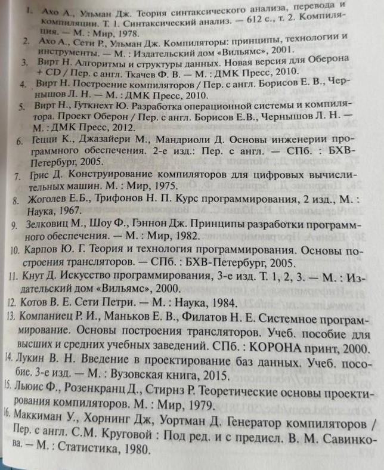

# Семинар № 1 - 3.09.2026

### Организационная информация

- Преподаватель: Киндинова Виктория Валерьевна. Искать в IT-18.
- Всего будет 16 семинаров;
- Курсовая работа состоит из 16 заданий на теорию и на практику;
- За курсовую нельзя получить выше 3, если нет практических заданий;
- Курсовая будет сдаваться поэтапно не вся целиком;
- Оценка за экзамен будет дублироваться с курсовой. Если оценка за экзамен не устраивает, то можно пойти на экзамен.

<u>Литература:</u>

- Теоретические основы проектирования компилятора (Льюис Ф., Розенкранц Д., Стирнц Р.)
- Конструирование компиляторов для цифровых вычислительных машин (Грис Д.) \

----

## Элементы теории формальных языков и грамматика

- **Алфавит $V$** - конечное множество символов
- **Символ $a_p$** - объект, который описывается атрибутами и методами. ($p$ - атрибут)
- **Цепочкой символов** называется любая конечная последовательность символов алфавита.
- Цепочка, которая не содержит ни одного символа называется **пустой** ($\varepsilon$). Предполагается, что самой буквы 
"$ \varepsilon $" нет в алфавите и лишь помогает обозначить пустую цепочку.
- $A \supseteq B$ (читается как "$A$ включает множество $B$") означает, что каждый элемент из $B$ содержится в $A$.
Пример: $\{c, d, e\} \supseteq \{c\}$
- Пусть $Z = \{1, 2, ...\}$ - бесконечное множество положительных целых чисел. Множество $B$ задаётся с помощью "$|$" 
(читается как "так что" или "при условии"). Пример: $B=\{x|x \in Z, x\mod 2 = 0\}$ (читается как, "$B$ - множество 
символов таких, что все элементы целые положительные числа и чётные")
- **Цепочкой символов $\alpha$ в алфавите $V$** называется любая <u>конечная</u> последовательность символов этого
алфавита. Пример: $V=\{0,1\}, \alpha = 10$
- **Длина цепочки $\alpha$** - число составляющих её символов. Обозначается $|\alpha|$
Пример: $\alpha = 010$ - $|\alpha| = 3$, $|\varepsilon|=0$
- **Декартово произведение $A \times B$** - множество пар $(a,b)$ и записывает как $A \times B = \{(a, b)| a \in A, b \in B\}$
- **Операция итерации $(a)^*$**. Результатом является множество включающее цепочки всевозможной длинны, построенной с
помощью символа $a$. Пример: $(a)^* = \{a, aa, ..., (aaa...)\}$
- **Унарный оператор, замыкание Клини, звезда Клини $V^*$** - определяется над множеством символов $V$, замкнут относительно
операции конкатенации из символов $V$. Результатом является бесконечное надмножество множества $V$ или множество цепочек символов включая $\varepsilon$.
Пример: $V = \{0, 1\}$, $V^*=\{\varepsilon, 0, 1, 11, 01, 00, 10, 100, ...\}$
- $V^+$ - $V^*/\varepsilon$
- **Оператор имплиуации $A \rightarrow B$** - бинарная логическая связь, читается как "Если $A$ то $B$" или "символ $A$ 
порождает $B$" применяется в правилах продукций.
- **Бинарный оператор вывода $\Rightarrow$** означает, что символ слева от операнда заменяют или подставляют символами справа
в соответствии с правилами продукции грамматики. Оператор применяется в порождающих системах(моделях) 
Пример: Правила: $A \rightarrow Bb$, $B \rightarrow c$. Тогда: $A \Rightarrow Bb \Rightarrow cb$ - вывод.
- **Операция (правило) перехода $\delta$** - правило перехода.
- **$\vdash$ бинарный оператор** - такт срабатывания модели автомата в соответствии с правилом перехода $\delta$.
Применяется в распознающих системах.

&nbsp;&nbsp;&nbsp;&nbsp; Появление модели формальных языков было обусловлено стремлением формализации естественных языков и языков программирования.

## Основные порождающие и распознающие модели описания формальных языков
### <u>Порождающие модели</u>
&nbsp;&nbsp;&nbsp;&nbsp; Для описания синтаксиса языков программирования наибольшее распространение получили следующие порождающие системы:
Бекуга-Наупа, Диаграма Вирта, <u>формальной грамматики</u>

&nbsp;&nbsp;&nbsp;&nbsp; В порождающих моделях предзадаются продукции состоящих из двух частей (левой и правой). В левой
части записывается определение в правой части варианты из которой может состоять определения.

&nbsp;&nbsp;&nbsp;&nbsp; Пример: "Он смотрит кино"

&nbsp;&nbsp;&nbsp;&nbsp; Синтаксическое правило для этого предложения:
1) Предложение состоит из подлежащего и группы сказуемого;
2) Подлежащее - "Он";
3) Группа сказуемого - сказуемое, дополнение;
4) Сказуемое - "смотрит";
5) Дополнение - "кино".

&nbsp;&nbsp;&nbsp;&nbsp; В рассматриваемом предложении элементы имеют фиксированный порядок.

&nbsp;&nbsp;&nbsp;&nbsp; Введём грамматический формализм, эквивалентный синтаксическому используя правила продукции.

&nbsp;&nbsp;&nbsp;&nbsp; Тогда порождающая модель для рассматриваемого предложения примет вид:
1) Предложение $\rightarrow$ подлежащее, группа сказуемого
2) Подлежащее $\rightarrow$ он
3) Группа сказуемого $\rightarrow$ сказуемое, дополнение
4) Сказуемое $\rightarrow$ смотрит
5) Дополнение $\rightarrow$ кино
