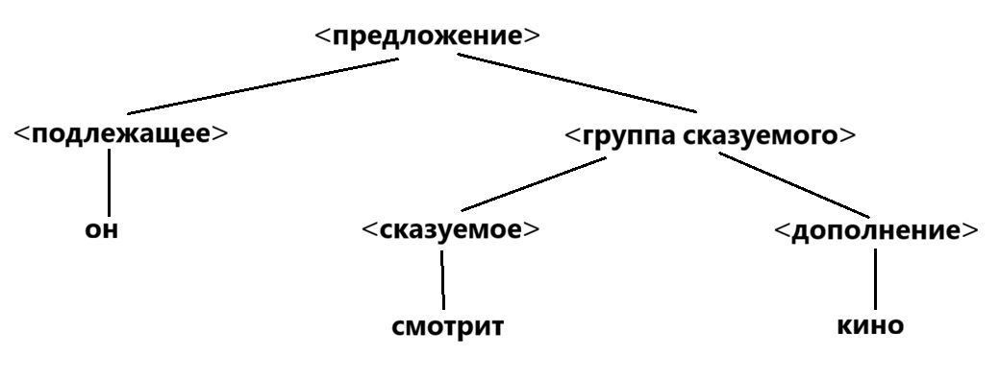
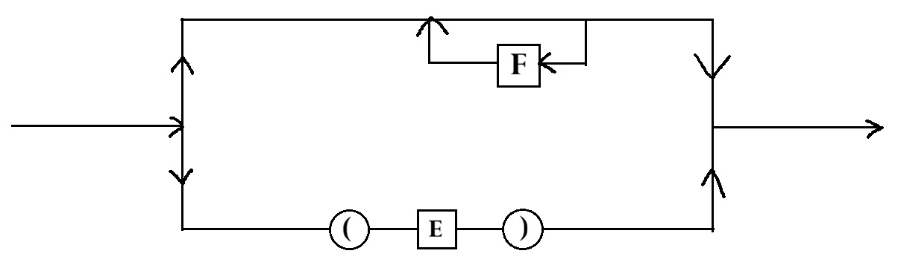

# Семинар № 2 - 10.09.2026
### Построение дерева

&nbsp;&nbsp;&nbsp;&nbsp; Нормальная форма Бэкуса или форма Бэкуса-Наура. Алгол-60 в 1960 годах.

БНФ - предстовляет из себя метоязык который используется для описания других метоязыков. $\xi ::= \eta$  - правила в форме БНФ. 

Интерпретация: 
- $::=$ - "есть",
- | - "или", 
- <> - в них записываются метолингвистические переменные (определяемое понятие)
- [] - факультативный элемент (необязательная часть),
- {} - множественный элемент (один из, элемент выбора (один элемент внутри скобки))

Через БНФ нотацию - $\alpha ::= \beta | \beta \gamma$ -> $\alpha ::= \beta[\gamma]$

Рассмотрим пример с предыдущего семинара в нотации БНФ:
- <предложение> ::= <подлежащее><группа сказуемого>
- <подлежащее> ::= он|она
- <группа сказуемого> ::= <сказуемое><дополнение>
- <сказуемое> ::= смотрит|обожает
- <дополнение> ::= кино

Аксиома - всегда есть целевой символ.

<предложение> $\Rightarrow$ <подлежащее><группа сказуемого> $\Rightarrow$ он<группа сказуемого> 
$\Rightarrow$ он<сказуемое><дополнение> $\Rightarrow$ он смотрит <дополнение> $\Rightarrow$ он смотрит кино

Данный пример демонстрирует левосторонний вывод.

<предложение> $\Rightarrow^*$ он смотрит кино.

$\Rightarrow^*$ - цепочка выводима не тривиальным способом

$\alpha_1 \Rightarrow^* \alpha_n$ - две последовательности связаны таким отношением, когда вторая получается их первой применением некоторой последовательности продукции,
когда $\alpha_n$ получается из $\alpha_1$ за 0 и более шагов.

### Диаграмма Вирта
Эти диаграммы позволяют визуально представить правила порождения. Каждому правилу соответствует диаграмма. 

- ИЛИ - обозначается разветвлениями и вершинами
- И - формализуются последовательными вершинами графа
- {} - метосимволы циклом

Вершины могут быть 2-ух типов:

- Терминальные $\bigcirc$
- Нетерминальные  $\square$

$T \rightarrow \{F\}|(E)$ - на месте фигурных скобок нужно смоделировать цикл в Диаграмме Вирта. 

## Формальные грамматики
&nbsp;&nbsp;&nbsp;&nbsp; Основная задача грамматики: одно из назначений грамматики определить бесконечное число слов языка с помощью конечного числа правил.

&nbsp;&nbsp;&nbsp;&nbsp; Поскольку формальный язык может быть и бесконечным, требуются механизмы позволяющие конечным образом представить бесконечные языки.

&nbsp;&nbsp;&nbsp;&nbsp; Каждый формальный язык в алфавите $V$ является подмножеством счётного множества $V^*$. 
Из теории множеств известно, что множество всех подмножеств счётного множества является несчётным. 
Таким образом мощность множества формальных языков больше мощности множества конечных описаний, следовательно, не каждый
язык представим в виде конечного описания.

## Порождающая грамматика
Порождающая грамматика G=<T,N,P,S>

- T - алфавит терминальных символов (терминалов)
- N - алфавит нетерминальных символов (T и N - дают пустое пересечение)
- P - конечное множество правил грамматики (правила продукций) $P=(T \cup N)^+ \times (T \cup N)^*$
- $(\alpha; \beta) \in P$ - элемент множества правил $\alpha \rightarrow \beta$, где $\alpha$ - левая часть правила, а $\beta$ - правая часть правила. Левая часть из любого правила должна содержать хотя бы один не терминал.
- S - начальный символ (нетерминал) грамматики (аксиома, цель) $S \in N$

$\alpha \rightarrow \beta_1$ , $\alpha \rightarrow \beta_2$, ..., $\alpha \rightarrow \beta_n$ =>
$\alpha \rightarrow \beta_1|\beta_2|...|\beta_n$ 

$\beta_i$ - альтернатива правила вывода из цепочки $\alpha$

Пример записи грамматики:

$G_{ex} = <\{0, 1\}, \{A, S\}, P, S>$

- $S \rightarrow 0A1$
- $0A \rightarrow 00A1$
- $A \rightarrow \varepsilon$ (признак укорачивающейся грамматики)

$\beta \in (T \cup N)^*$ непосредственно выводима из $\alpha \in (T \cup N)^+$ в грамматике G ($\alpha \Rightarrow_G \beta$) если $\alpha = \xi_1 \gamma \xi_2$, $\beta = \xi_1 \delta \xi_2$, где 
$\xi_1, \xi_2, \delta \in (T \cup N)^*$ $\gamma \in (T \cup N)^+$ и существует $\gamma \rightarrow \delta \in P$

Пример: 0А1 => 00А11 в данном пример $\xi_1=\varepsilon$, a $\xi_2 = 1$, и $\gamma = 0A$, $\delta = 00А1$

