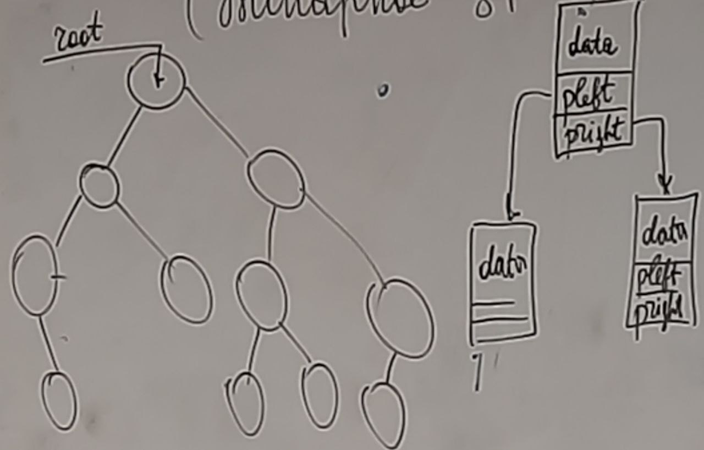
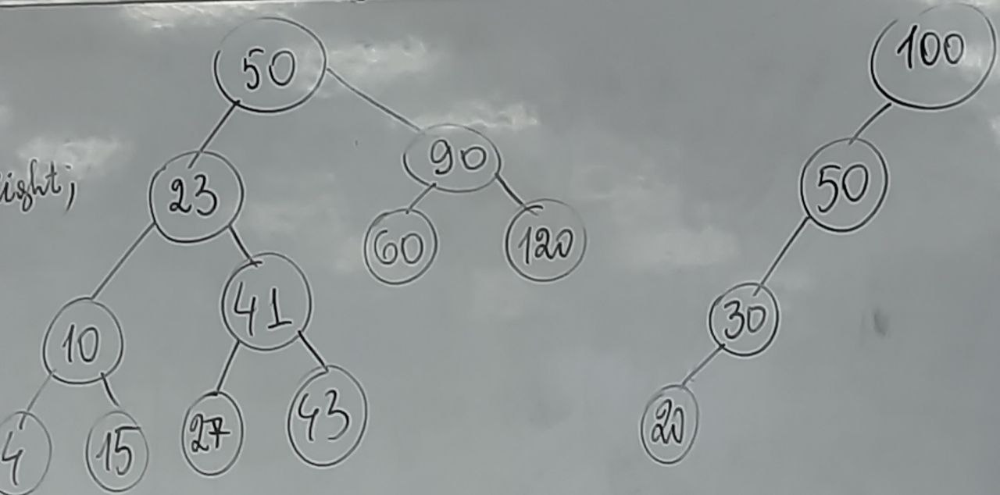
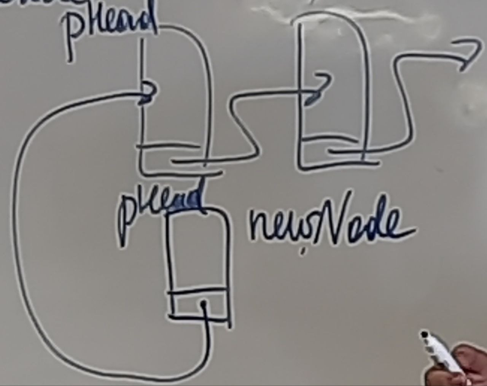
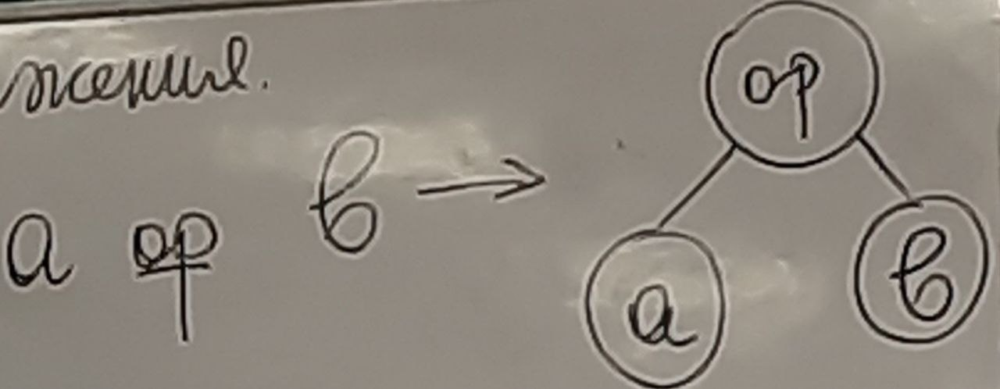
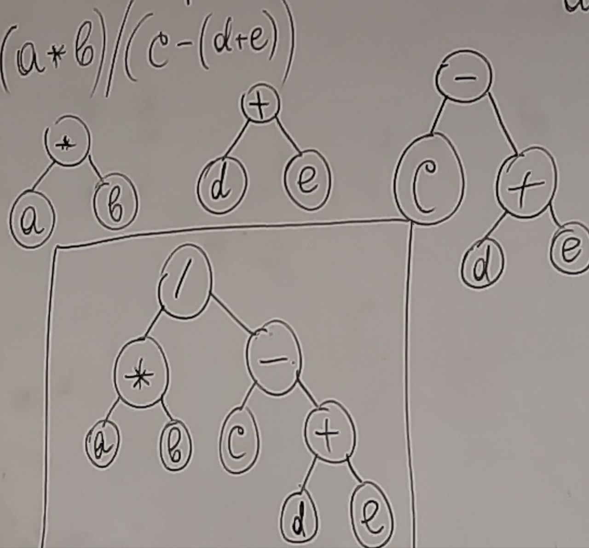
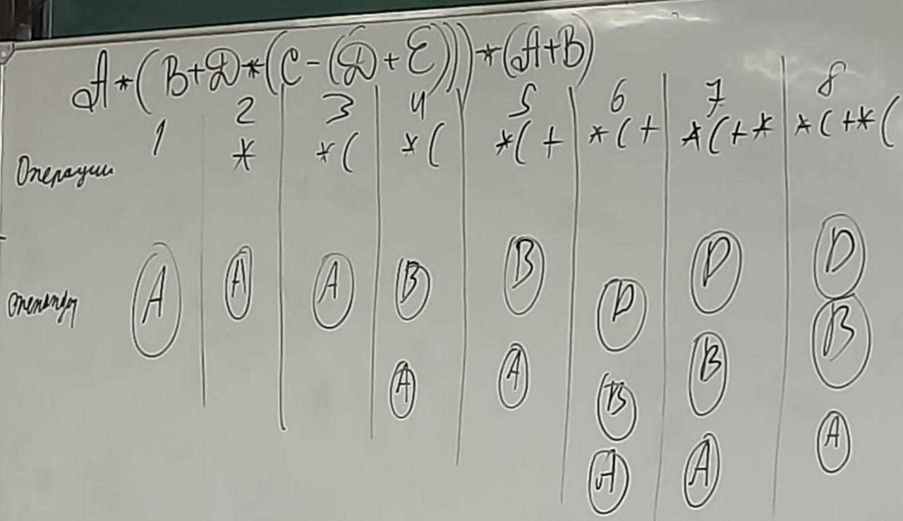
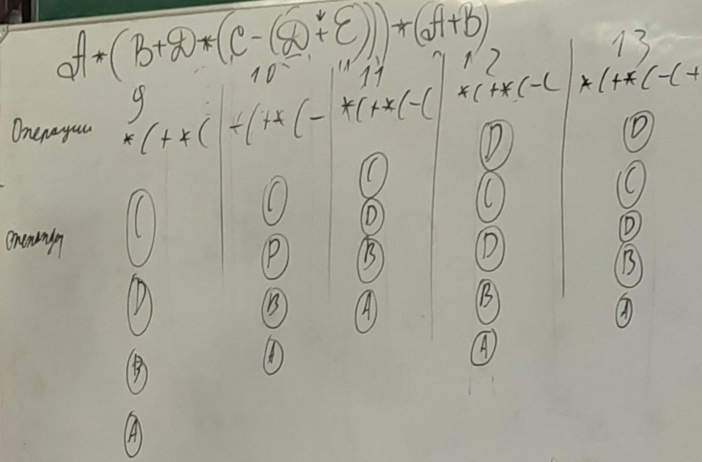
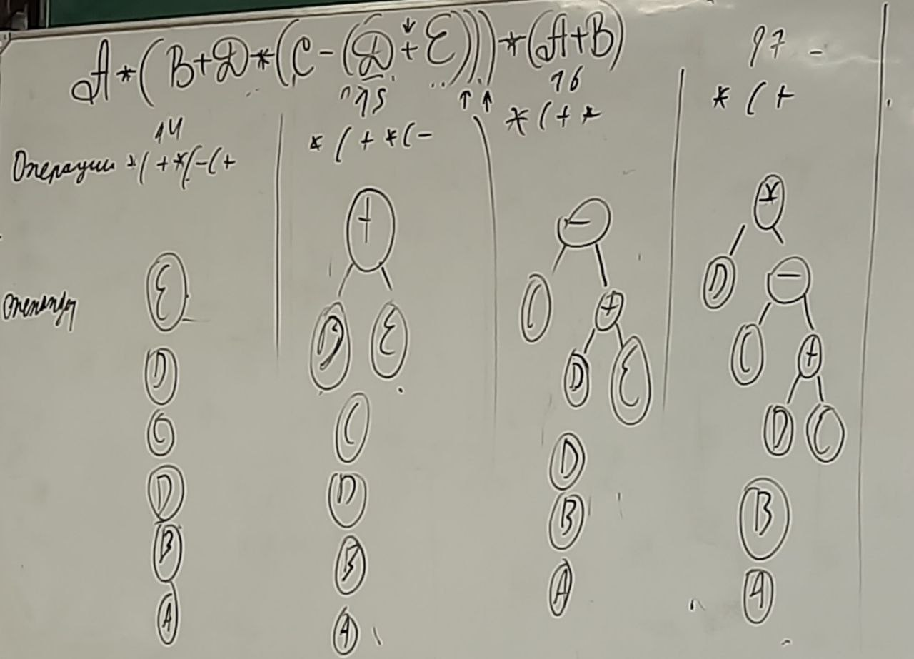
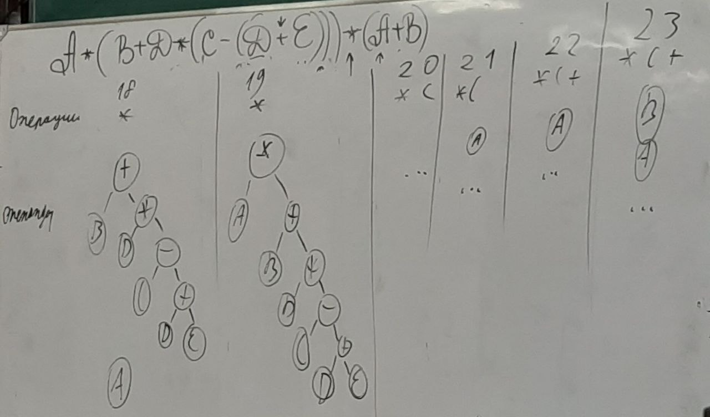
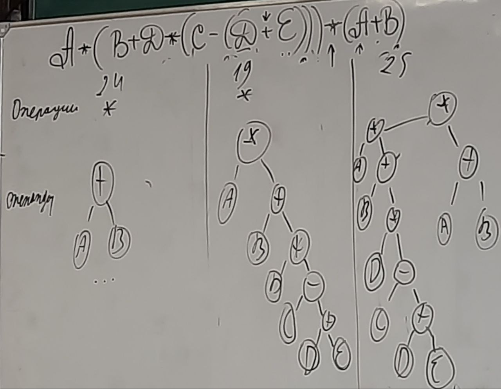

# Двоичное дерево (Бинарные деревья)
## Что такое бинарное дерево?
\
Объявление структуры
```c
struct TreeNode{
    int data;
    struct TreeNode *pleft;
    struct TreeNode *pright;
};
```
Необходимо иметь правило для сравнения данных, которые могут содержаться в *data*.\
Это позволяет реализовывать **быстрый поиск данных**.\
Сложность обхода сбалансированного дерева **O(log(n))**;\
\
Правое дерево считается вырожденным, поэтому сложность в этом случае **O(n)**
Такое дерево теряет все свои преимущества в поиске.
## Обход двоичного дерева
```c
void PrintTree(struct TreeNode *root){
    if (root == NULL){
        return;
    }
    PrintTree(root->pleft);
    printf("%d\n", root->data);
    PrintTree(root->pright);
}
```
Если строить дерево из отсортированного файла, то получится вырожденное дерево.\
## Поиск со вставкой
Элемент поиска необходимо найти в дереве:
+ Если он найден, то уведомить об этом 
+ Если он не найден, то добавить его в дерево.\
\
Реализация с помощью рекурсии
```c
struct TreeNode *insert(struct TreeNode *root, int element){
    if (root == NULL) {
        root = CreateNode(element);
        return root;
    }
    if (root->data == element){
        return root;
    }
    else if (root->data > element){
        if (root->pleft == NULL){
            root->pleft = CreateNode(element);
            return root->pleft;
        }
        insert(root->pleft, element);
    }
    else {
        if (root->pright == NULL){
            root->pright = CreateNode(element);
            return root->pright;
        }
        insert(root->pleft, element);
    }
}
```

Реализация без рекурсии:
```c
struct TreeNode *insert(struct TreeNode * root, int element){
    struct TreNode = root;
    while (ptr != NULL){
        if(prt->data == element){
            return prt;
        }
        else if (ptr->data > element){
            if(ptr->pleft == NULL){
                ptr->pleft = CreatrNode(element);
                return ptr->pleft;
            }
            ptr = ptr->pleft;
        }
        else{
             if(ptr->pright == NULL){
                ptr->pright = CreatrNode(element);
                return ptr->pright;
            }
            ptr = ptr->pright;
        }
    }
}
```
## Дерево скобочного выражения
(a * b) / (c - (d + e))\
\


```c
int Vars[26];
char ch;
ch = fgetc(fi);
//в ch лежит имя переменной
Vars[ch - 'a'];
// Код отображает идею, конечно же он не работает
```
## Алгоритм Дейкстры (построение дерева скобочного выражения)
2 стека: 
+ Операндов (аргументы)(Содержит деревья)
+ Операции (действий)(Содержит символы)\
Вход: строка-формула\
1. Если текущий символ - **символ буквы**, то создаётся **узел дерева**, в который помещается этот аргумент, а ссылки на левое и правое поддеревя **пустые**.
Указатель на созданный элемент дерева заносится в стек операндов.
2. Если текущий символ - **символ открывающей скобки**, то заносим его в стек операций.
3. Если текущий символ - **знак операций**, и если стек операций не пуст: 
   1. если приоритет операции **больше** вершины стека, то заносим его в стек операций
   2. иначе **формируем узел дерева**, в поле "данные" которого помещается **символ текущей операции**, указатель на правое поддерево - это операнд с вершины операндов, указатель на левое поддерево следующий элемент из стека операндов.
   3. Обработанные операнды **удаляются** из стека, а в стек операндов помещается указатель на **созданный узел**.
   4. Эти действия повторять до тех пор, пока приоритет текущей операции не станет **больше** приоритета операций на вершине стека операций или стек операций не опустеет. 
   5. Знак текущей операции помещается в стек операций.
4. Если текущий символ - **символ закрывающей скобки**, то создаём узел дерева, в поле данного которого помещается операция с вершины стека операции, указатели на левое и правое поддеревья это элементы с вершины стека операндов, добавленные операнды удаляем из стека операндов, а добавленную операцию из стеков операции, созданный указатель добавляем в стек операндов, повторяем до тех пор, пока не будет встречена открывающая скобка.
5. Если достигли конца формулы и стек операций не пуст, то создаем узел дерева, в поле данного которого помещаем знак операции с вершины стека операций, в указатели левого и правого поддеревьев помещаем элементы с вершины стека операндов. Делаем до тех пор, пока стек операций не будет пуст.\
Пример применения алгоритма:\




