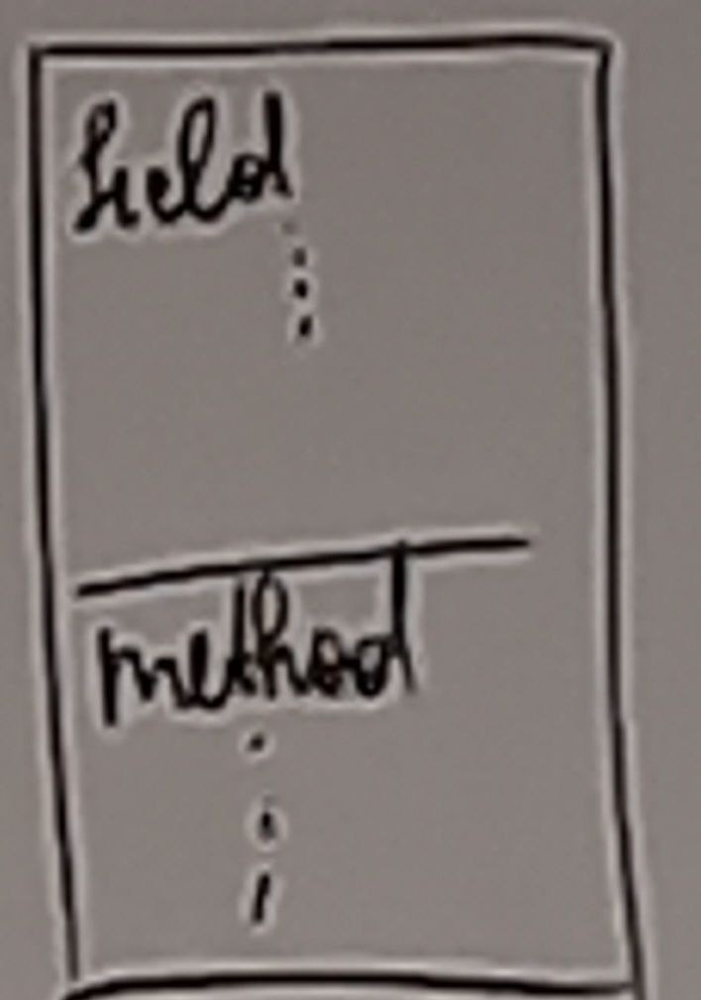
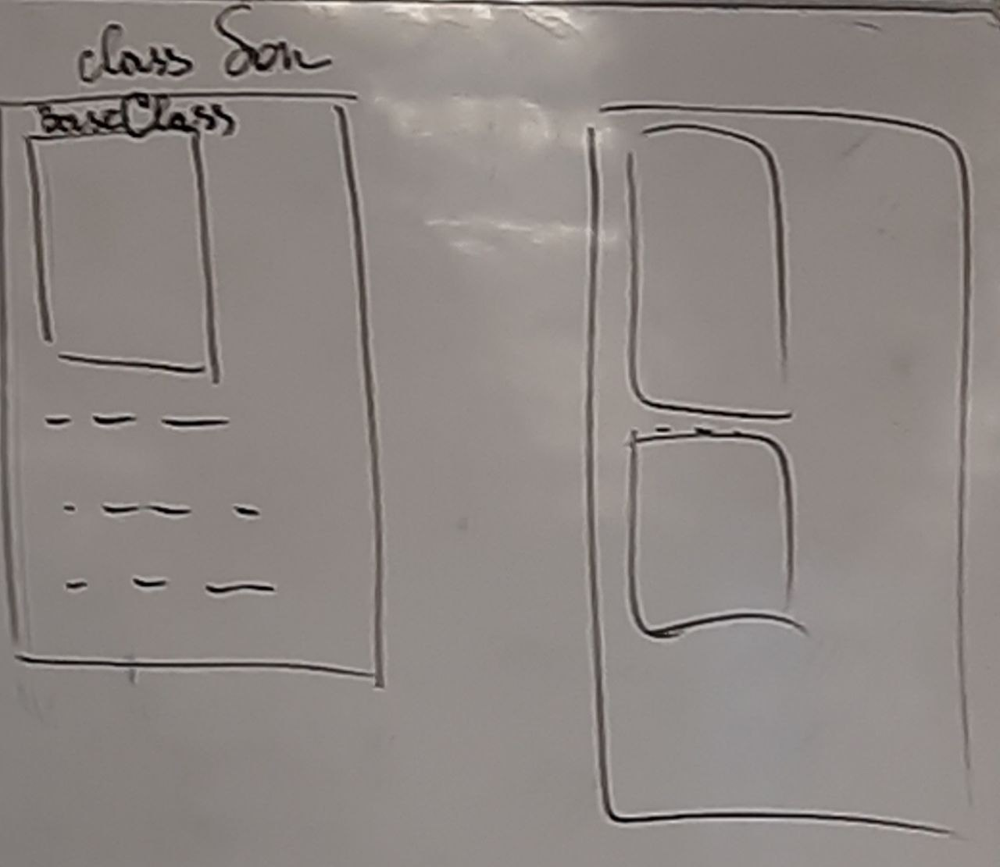
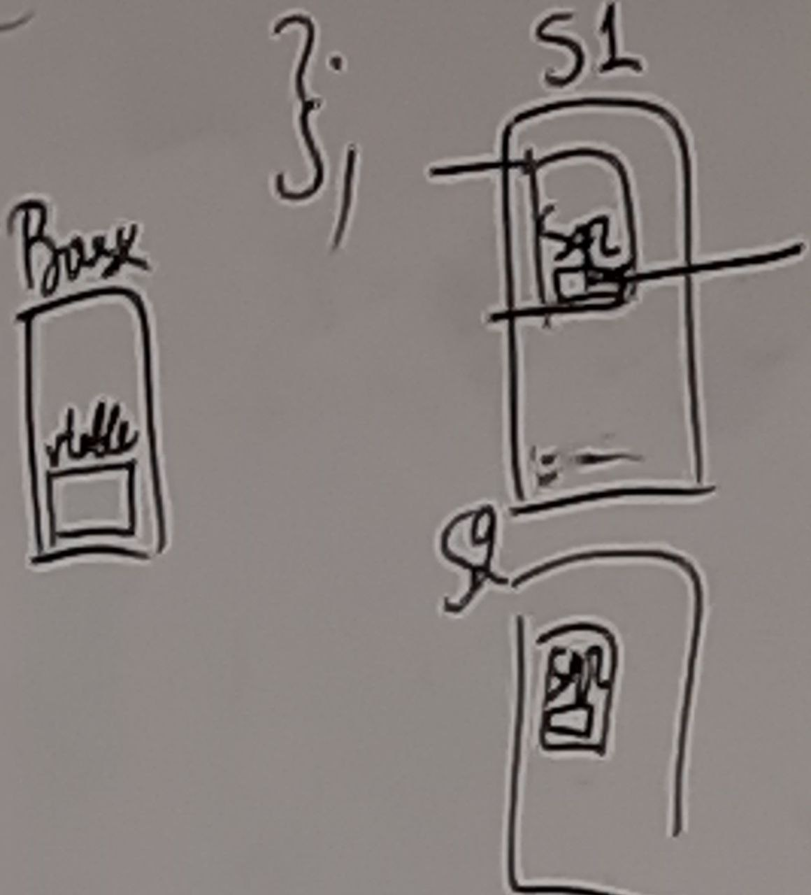

# C++. ООП
- Инкапсуляция - делает поля и методы одним объектом 

- Наследование - концепция, которая позволяет использовать один класс как базу для другого класса
```c
class Son: public BaseClass{
    ...
};
```
\

- Полиморфизм - 
```c
class Base{
    public:
        virtual double Sqr();
    ...
};

class S1: public Base{
    public:
        virtual double Sqr();
    ...
};
class S2: public Base{
    ...
};
int main(void){
    S1 o1;
    S2 o2;
    Base b;
    p = o1.Sqr();
    p = o2.Sqr();
    p = b.Sqr();
    Base *pb = &o1; // Всё чего нет в Base отрежется
    pb->Sqr();
}
```

Если нет стандартной реализации
```c
class Base{
    public:
    virtual double Sqr() = 0;
}
```
Класс называется абстрактным, если в нём есть хотя бы 1 виртуальная функция. 
Если в классе только виртуальные функции, то он называется интерфейсом.


Дополнительные книги:
- Шилдт "Самоучитель по C++"
- Липпман "Язык программирования C++" 
- Прата "Язык програмирования C++"

### Class:
- **public** - открытые части класса
- **private** - скрытие от пользователя
- **protected** - для внешних пользователей такой же как и private (временное пояснение)

### Передача по ссылке
Разница между указателем и ссылкой в том, что передача по ссылке
не требует дальнейшего разыменования, для того чтобы работать с объектом. 
Не создаётся локальная копия передаваемого аргумента.
```c
<Ret_Type> Foo(<Type>& ob){
    
}
void foo(int& x){
    x = 10;
}
```
- Конструкторы нужны для создания объекта (Ничего не возвращает, даже void)
- Деструкторы нужны для удаления объекта\
**_Конструктор не может быть виртуальным, т.к. подменять логику инициализации опасно!!!_**
