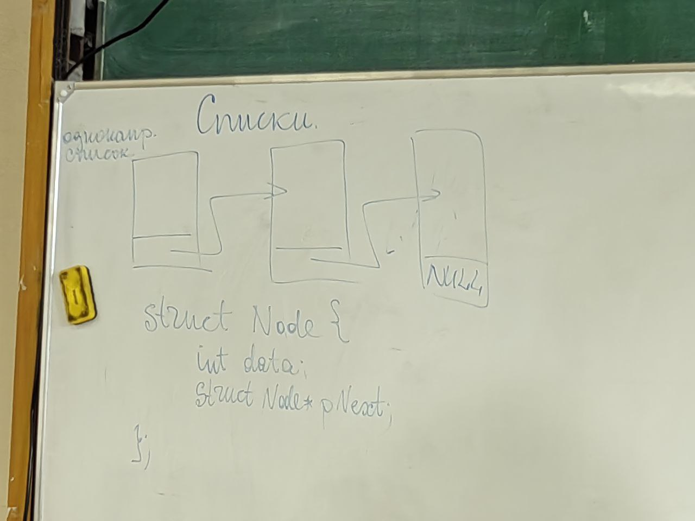
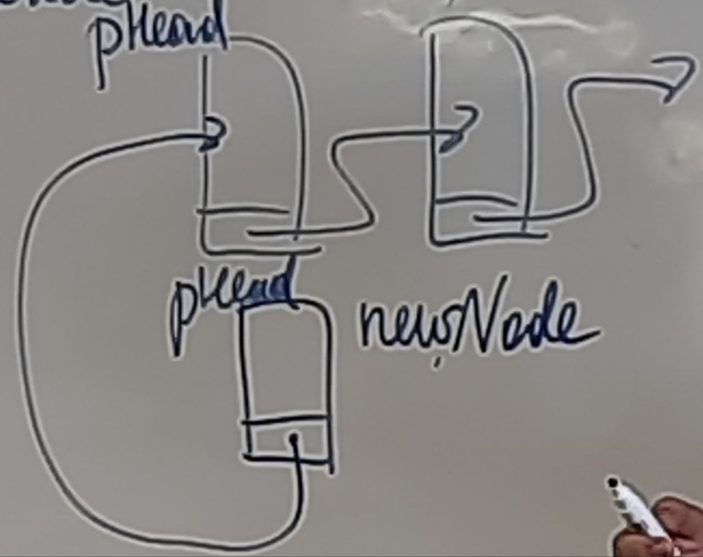
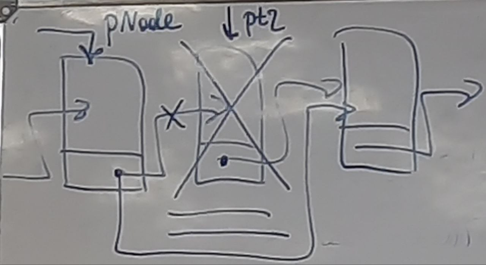
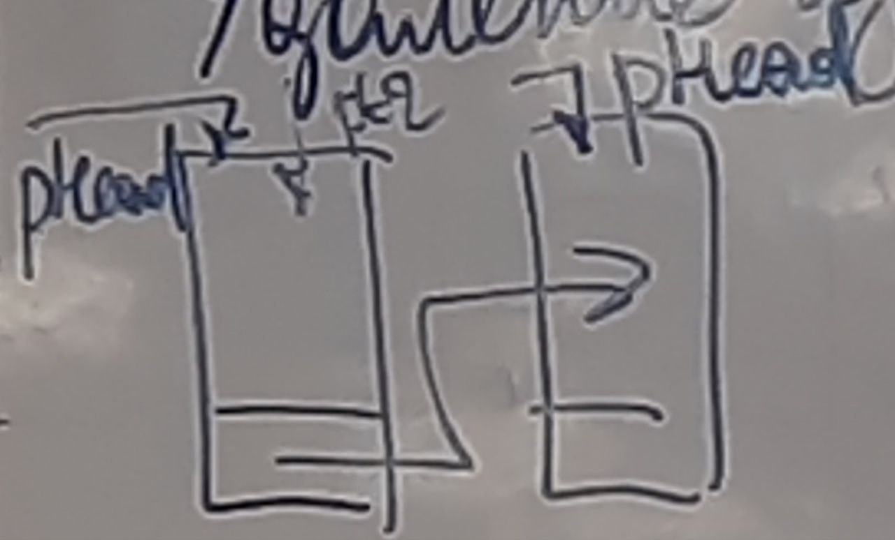
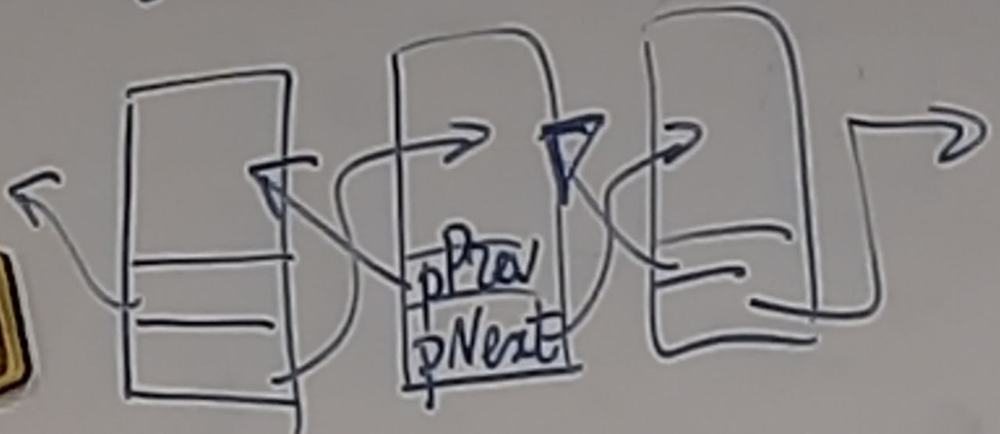
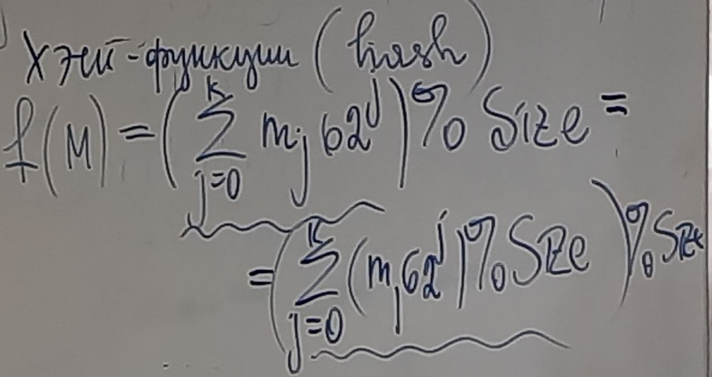
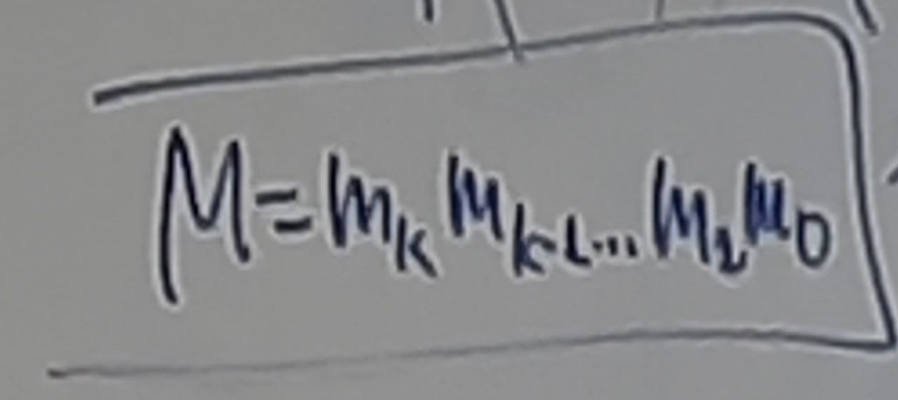

# Абстрактные типы данных

Самоссылочные структуры. \
В структурах разрешено иметь тип данных указатель на эту же структуру. тип самой структуры иметь нельзя.

## Списки 
### Однонаправленный список
 \
``` C
struct Node {
    int data; // может быть и другой тип данных
    struct Node *pNext;
};
``` 
\
1. Объявление 
``` C
struct Node *pHead = NULL;
```
2. Создание элемента списка \
``` C
struct Node* Create(int data){
    struct Node *ptr = NULL;
    ptr = (struct Node *) malloc(sizeof(struct Node);
    // обязательно проверка маллока
    // для этого менять способ реализации, например возвращать код ошибки.
    ptr->data = data;
    ptr->pNext = NULL;
    return ptr;
}
```
3. Добавление элемента \

```c
void Insert(struct Node *pNode, struct Node * newNode){
    newNode->pNext = pNode->Next;
    pNode->pNext = newNode;
}
```
4. Добавление элемента в начало списка \

```c
void PushFront(struct Node **pHead, struct Node *newNode){
    newNode->pNext = *pHead;
    *pHead = newNode;
    // pHead = PushFront(pHead, NewN); использование функции
}
```
5. Удаление элемента \

```c
void Delete(struct Node *pNode){
    struct Node * ptr;
    ptr = pNode->pNext;
    pNode->pNext = ptr->pNext;
    // pNode->pNext = pNode->pNext->pNext так можно но не нужно
    free(ptr);
}
```

6. Удаление из начала списка \

```c
struct Node * ptr = pHead;
pHead = pHead->pNext;
free(ptr); // Можно попробовать сделать метод
```
7. Обход списка
```c
ptr = pHead;
while(ptr != NULL) {
    printf("%d\n", ptr->data);
    ptr = ptr->pNext;
}
```
### Двунаправленный (двусвязный) список

## Стек
Канонические операции **push** и **pop**.
Есть ещё функция **peak** отвечает за просмотр элемент на вершине стека
## Очередь
# Применение стеков для вычисления арифметических выражений
2 * 5 + 3 \
2 + 5 * 3 \
(4 + 7) * 5 \
(6 + 2) * 5 - 8 / 4 -> 6 2 + 5 * 8 4 / - постфиксная запись \
а ф б -> а б ф \
**Перевод в постфиксную запись** \
вх: строка, в которой содержится 1 арифметическое выражение. \
вых: строка, в которой содержится постфиксное выражение. \
\
**Стек операций** - стек содержащий операции во время работы алгоритма.
1. Читать входную строку последовательно посимвольно слева на право 
2. Если текущий символ является символом цифры, то копируем её в выходной поток.
3. Если текущий символ является (, то поместить эту скобку в стек.
4. Если текущий символ знак операции, то извлекать из стека операции имеющие равный или больший приоритет, относительно текущей операции, извлекаемые операции копировать в выходной поток. Текущую операцию поместить в стек.
5. Если текущий символ ), то извлекать операции из стек пока не достанем (. Извлекаемые операции добавляем выходной поток.
6. Извлечь все операции стека в выходной поток

| Шаг | Стек | Выход             |
|-----|------|-------------------|
| 1   | (    |                   |
| 2   | (    | 6                 |
| 3   | (+   | 6                 |
| 4   | (+   | 6 2               |
| 5   |      | 6 2 +             |
| 6   | *    | 6 2 +             |
| 7   | *    | 6 2 + 5           |
| 8   | -    | 6 2 + 5 *         |
| 9   | -    | 6 2 + 5 * 8       |
| 10  | - /  | 6 2 + 5 * 8       |
| 11  | - /  | 6 2 + 5 * 8 4     |
| 12  |      | 6 2 + 5 * 8 4 / - |

Хэш-функции \
 \
 \
Коллизия - совпадение значения хеш-функции при разных аргументах \
